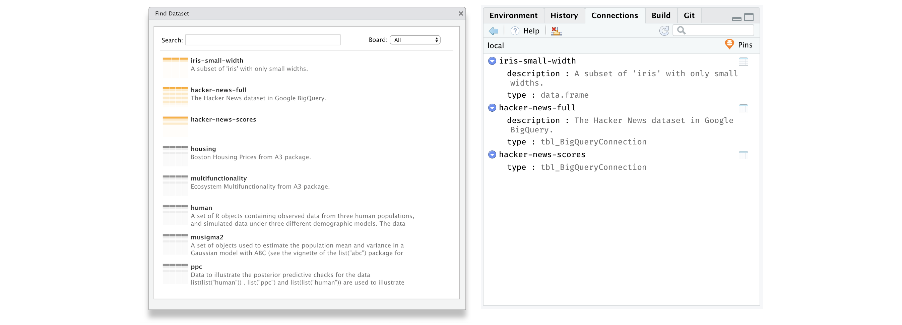

```{r setup, echo=FALSE, message=FALSE}
pins::unpin("iris")
pins::unpin("iris-small-width")
pins::unpin("sales")
pins::unpin("python-df")

knitr::opts_chunk$set(eval = TRUE)
knitr::opts_chunk$set(fig.path = "tools/readme/", dev = "png")
```

[](https://travis-ci.org/javierluraschi/pins) [](https://cran.r-project.org/package=pins) 

- **Track** local and remote datasets using `pin()` and `get_pin()`.
- **Discover** new datasets across different boards using `find_pin()`.
- **Share** datasets with your team, or the world with `use_board()`.
- **Pins** are also available with RStudio, Kaggle and databases boards.

## Installation

You can install `pins` using the `remotes` package:

``` r
install.packages("remotes")
remotes::install_github("rstudio/pins")
```

## Track

`pins` allows you to track local datasets using `pin()` and `get_pin()` as well as remote datasets. Datasets are tracked through a pin, a tool to help you track datasets without worrying too much of where the actual dataset lives. A pin can be either tabular data or arbitrary files.

Lets take a look at using pins with local datasets first.

### Local Datasets

You can track your datasets privately by pinning them with `pin()`.

```{r local-pin}
library(dplyr, warn.conflicts = FALSE)
library(pins)

iris %>%
  filter(Sepal.Width < 3, Petal.Width < 1) %>%
  pin("iris-small-width", "A subset of 'iris' with only small widths.")
```

You can then retrieve them back with `get_pin()`.

```{r local-get-pin}
get_pin("iris-small-width")
```

For instance, once a dataset is tidy, you are likely to reuse it several times. You might also have a past analysis in GitHub, but you might not want to clone, install dependencies and rerun your code just to access your dataset. Another use case is to cross-join between datasets to analyse across multiple projects or help you remember which datasets you've used in the past.

While it's useful to pin local datasets, pins really shine when working with remote datasets.

### Remote Datasets

When analysing data, it is common to find code that makes use of **remote files**. For example,

```{r eval=FALSE}
sales <- read.csv("https://raw.githubusercontent.com/facebook/prophet/master/examples/example_retail_sales.csv")
```

While this works fine most of the time, if the remote dataset is removed or if you are working offline, the previous code will simply break. Instead, you can `pin()` the remote dataset file before reading it,

```{r}
sales <- read.csv(pin("https://raw.githubusercontent.com/facebook/prophet/master/examples/example_retail_sales.csv", "sales"))
```

While the code is similar, `pin()` will cache remote datasets and trigger a warning when the `pin()` fails to refresh; this is much better than having your code completely break in the absence of the remote dataset, or worse, loosing the entire dataset if the remote location breaks.

Some datasets are stored in **remote databases** which you usually access with `DBI` or `dplyr`, while they don't present the risk of being deleted by mistake, there are also bennefits to using `pins` with databases, see [Database Pins]().

## Discover

The `pins` package can help you discover interesting datasets by specifying alternate boards. A board is the default storage location for your pins, by default pins are saved and searched in your local machine, but you can also search [CRAN](https://cran.r-project.org) packages and [Kaggle](https://kaggle.com).

You can search CRAN datasets that contain "seattle" in their description or name as follows:

```{r find-pin-in-cran}
find_pin("seattle", board = "packages")
```

You can the retrieve a specific dataset with `get_pin()`:

```{r get-pin-from-cran}
get_pin("hpiR_seattle_sales", board = "packages")
```

To search Kaggle datasets with `find_pin()`, you will have to download your token file from [kaggle.com/me/account](https://kaggle.com/me/account) and then register the Kaggle board by running:

```{r register-kaggle-board, eval=FALSE}
register_board("kaggle", token = "<path-to-kaggle.json>")
```

From now on, you can search the Kaggle board suing `find_pin("seattle", board = "kaggle")`, or you can also search all boards by not specyfing a particular board:

```{r find-pin-everywhere}
find_pin("seattle")
```

## Share

`pins` supports shared storage locations using boards. A board is an storage location to store pins for personal use or to share them with your team, or publicly with the world. Use `use_board()` to choose a board, currently  `rstudio` and `database` boards are supported; however, the `pins` package provides an extensible API you can use to store pins anywhere. In addition, you can share dataset pins with Python users through the `pins` pip package.

Sharing pins in RStudio and Python is presented next, you can read about sharing in database boards under [Using Databases]().

### RStudio Connect

**RStudio Connect** can be used to share pins within your organization, to
use this feature you will need to configure a [publishing](https://docs.rstudio.com/connect/user/publishing.html)
account in RStudio.

```{r eval=FALSE}
use_board("rstudio")
```

When using multiple publishing servers, you can specify an specific server through `use_board("rstudio", "<server-name>")`.

When using `pins` within RMarkdown documents that you want to run at a given schedule, you'll have to first retrieve your publishing secret credentials:

```{r eval=FALSE}
get_board("rstudio")$secret()
```

Followed by specifying that secret in `use_board()`, this can be securely accomplish by defining an environment variable `secret` with the contents from the previous step in RStudio Connect, please treat your credentials with care!

```{r eval=FALSE}
use_board("rstudio", secret = Sys.getenv("secret"))
```

### Python

You can install `pins` using `pip`:

```{bash eval=FALSE}
pip install git+https://github.com/rstudio/pins/#egg=pins\&subdirectory=python --user
```

You can then track your datasets privately with `pin()`,

```{python}
import pins
import pandas as pd

pins.pin(pd.DataFrame({"a": [1.0, 2.0, 3.0]}), "python-df")
```

and retrieve them back with `get_pin()`.

```{python}
pins.get_pin("iris-small-width")
```

You can search datasets that contain “seattle” in their description or
name as follows:

```{python}
pins.find_pin("seattle")
```

You can then retrieve a specific dataset with `get_pin()`:

```{python}
pins.get_pin("hpiR_seattle_sales").head(5)
```

## RStudio

This package provides an [RStudio Addin](https://rstudio.github.io/rstudio-extensions/rstudio_addins.html) to search for datasets and an [RStudio Connection](https://rstudio.github.io/rstudio-extensions/rstudio-connections.html) extension to track local or remote datasets.



The addin provides a list of datasets and visual clues that describe how large and wide eachd dataset is.
