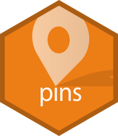

```{r, echo=FALSE, message=FALSE}
knitr::opts_chunk$set(
  warning = FALSE,
  fig.path = "tools/readme/", 
  dev = "png",
  dpi = 96,
  comment = "#>",
  collapse = TRUE
)

ggplot2::theme_set(ggplot2::theme_light())
```

<!-- badges: start -->
[](https://github.com/rstudio/pins/actions)
[](https://cran.r-project.org/package=pins)
[](https://codecov.io/gh/rstudio/pins?branch=master)
<!-- badges: end -->

## Overview



You can use the `pins` package to:

- **Pin** remote resources locally with `pin()`, work offline and cache results.
- **Discover** new resources across different boards using `pin_find()`.
- **Share** resources in local folders, GitHub, Kaggle, and RStudio Connect by 
  registering new boards with `board_register()`.

## Installation 

```{r eval = FALSE}
# Install the released version from CRAN:
install.packages("pins")
```

To get a bug fix, or use a feature from the development version, you can install pins from GitHub.

```{r eval = FALSE}
# install.packages("remotes")
remotes::install_github("rstudio/pins")
```

## Usage

```{r setup}
library(pins)
```

### Pin

There are two main ways to pin a resource:

*   Pin a remote file with `pin(url)`. This will download the file and make 
    it available in a local cache:
  
    ```{r}
    url <- "https://raw.githubusercontent.com/facebook/prophet/master/examples/example_retail_sales.csv"
    retail_sales <- read.csv(pin(url))
    ```
    
    This makes subsequent uses much faster and allows you to work offline. 
    If the resource changes, `pin()` will automatically re-download it; if
    goes away, `pin()` will keep the local cache.
    
*   Pin an expensive local computation with `pin(object, name)`:

    ```{r, message = FALSE}
    library(dplyr)
    retail_sales %>%
      group_by(month = lubridate::month(ds, T)) %>%
      summarise(total = sum(y)) %>%
      pin("sales_by_month")
    ```
    
    Then later retrieve it with `pin_get(name)`.  
    
    ```{r}
    pin_get("sales_by_month")
    ```

### Discover

You can also discover remote resources using `pin_find()`. It can search for resources in CRAN packages, Kaggle, and RStudio Connect. For instance, we can search datasets mentioning "seattle" in CRAN packages with:

```{r}
pin_find("seattle", board = "packages")
```

Notice that the full name of a pin is `<owner>/<name>`. This namespacing allows multiple people (or packages) to create pins with the same name.

You can then retrieve a pin through `pin_get()`:

```{r}
seattle_sales <- pin_get("hpiR/seattle_sales") %>% print()
```

Or explore additional properties in this pin with `pin_info()`:

```{r}
pin_info("hpiR/seattle_sales")
```

### Share

Finally, you can share resources with other users by publishing to [Kaggle](https://pins.rstudio.com/articles/boards-kaggle.html), [GitHub](https://pins.rstudio.com/articles/boards-github.html), [RStudio Connect](https://pins.rstudio.com/articles/boards-rsconnect.html), [Azure](https://pins.rstudio.com/articles/boards-azure.html), [Google Cloud](https://pins.rstudio.com/articles/boards-gcloud.html), [S3](https://pins.rstudio.com/articles/boards-s3.html), [DigitalOcean](https://pins.rstudio.com/articles/boards-dospace.html) or integrate them into your [website](https://pins.rstudio.com/articles/boards-websites.html) as well.

To publish to Kaggle, you would first need to register the Kaggle board by creating a [Kaggle API Token](https://www.kaggle.com/me/account):

```{r, eval = FALSE}
board_register_kaggle(token = "<path-to-kaggle.json>")
```

You can then easily publish to Kaggle:

```{r eval = FALSE}
pin(seattle_sales, board = "kaggle")
```

<center>
  
</center>

Learn more in `vignette("boards-understanding")`

### RStudio

Experimental support for `pins` was introduced in RStudio Connect 1.7.8 so that you can use [RStudio](https://rstudio.com/products/rstudio/) and [RStudio Connect](https://rstudio.com/products/connect/) to discover and share resources within your organization with ease. To enable new boards, use [RStudio's Data Connections](https://blog.rstudio.com/2017/08/16/rstudio-preview-connections/) to start a new 'pins' connection and then select which board to connect to:

<center>
  
</center>

Once connected, you can use the connections pane to track the pins you own and preview them with ease. Notice that one connection is created for each board.

<center>
  
</center>

To **discover** remote resources, simply expand the "Addins" menu and select "Find Pin" from the dropdown. This addin allows you to search for pins across all boards, or scope your search to particular ones as well:

<center>
  
</center>

You can then **share** local resources using the RStudio Connect board. Lets use `dplyr` and the `hpiR_seattle_sales` pin to analyze this further and then pin our results in RStudio Connect.

```{r}
board_register_rsconnect(name = "myrsc")
```
```{r}
seattle_sales %>%
  group_by(baths = ceiling(baths)) %>%
  summarise(sale = floor(mean(sale_price))) %>%
  pin("sales-by-baths", board = "myrsc")
```

After a pin is published, you can then browse to the pin's content from the RStudio Connect web interface.

<center>
  
</center>

You can now set the appropriate permissions in RStudio Connect, and voila! From now on, those with access can make use of this remote file locally!

For instance, a colleague can reuse the `sales-by-baths` pin by retrieving it from RStudio Connect and visualize its contents using ggplot2:

```{r rstudio-plot-pin, fig.align='center'}
library(ggplot2)
board_register_rsconnect(name = "myrsc")

pin_get("sales-by-baths", board = "myrsc") %>%
  ggplot(aes(x = baths, y = sale)) +
  geom_point() + 
  geom_smooth(method = 'lm', formula = y ~ exp(x))
```

Pins can also be automated using scheduled R Markdown. This makes it much easier to create Shiny applications that rely on scheduled data updates or to share prepared resources across multiple pieces of content. You no longer have to fuss with file paths on RStudio Connect, mysterious resource URLs, or redeploying application code just to update a dataset!
