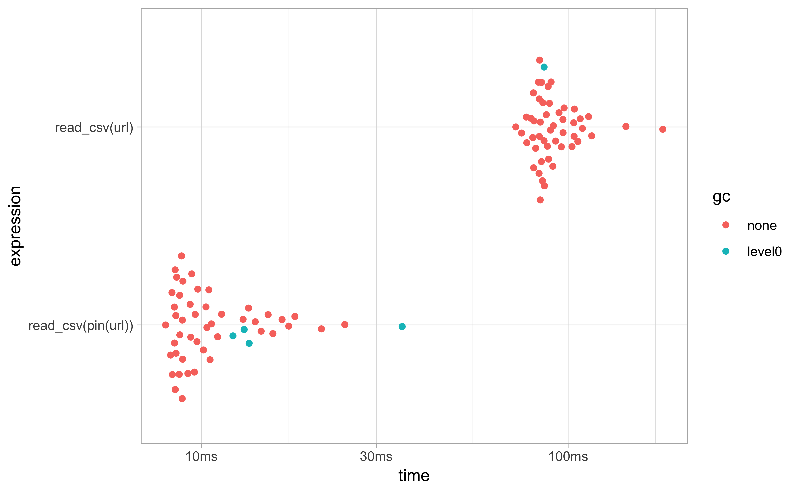
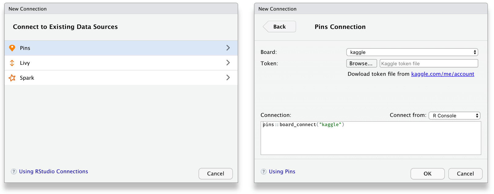
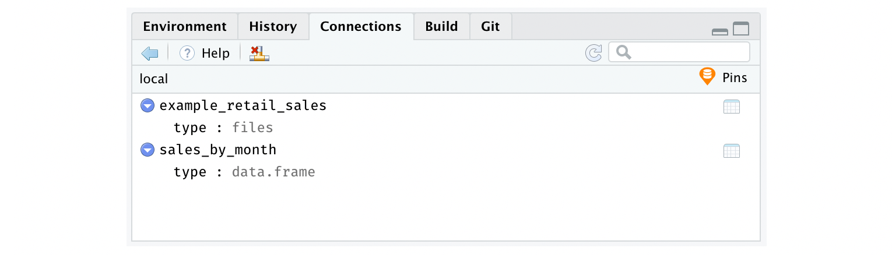
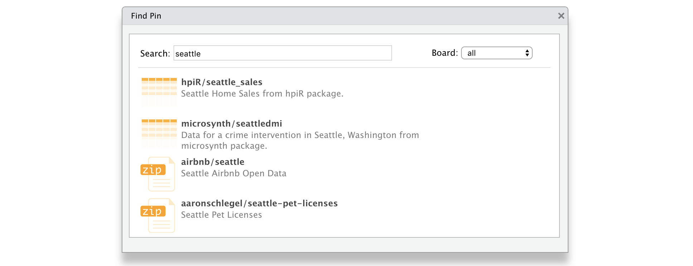
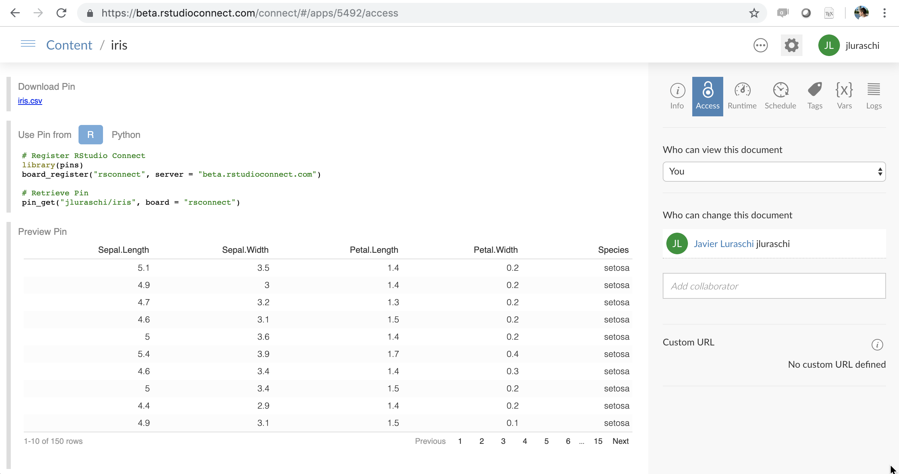
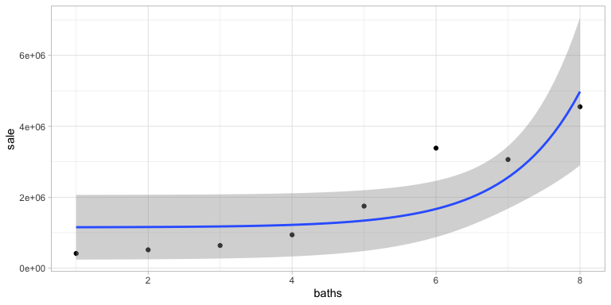

pins: Pin, Discover and Share Resources
================

[](https://travis-ci.org/rstudio/pins)
[](https://ci.appveyor.com/project/rstudio/pins)
[](https://cran.r-project.org/package=pins)
[](https://codecov.io/gh/rstudio/pins)
[](https://cranlogs.r-pkg.org/)
[](https://www.tidyverse.org/lifecycle/#maturing)
[](https://gitter.im/rstudio/sparklyr?utm_source=badge&utm_medium=badge&utm_campaign=pr-badge&utm_content=badge)
[](https://github.com/rstudio/pins/stargazers)

You can use the `pins` package to:

  - **Pin** remote resources locally with `pin()`, work offline and
    cache results with ease.
  - **Discover** new resources across different boards using
    `pin_find()`.
  - **Share** resources in local folders, GitHub, Kaggle or RStudio
    Connect by registering new boards with `board_register()`.
  - **Resources** can be anything from CSV, JSON, or image files to
    arbitrary R objects.

If you find yourself using `download.file()` or asking others to
download files before running your R code, use `pin()` to achieve fast,
simple and reliable reproducible research over remote resources.

To start using `pins`, install this package as follows:

``` r
install.packages("pins")
```

First, you can **pin** remote files with `pin()` to cache those files
locally, such that, even if the remote resource is removed or while
working offline – your code will keep working by using a local cache.
Since `pin(x)` pins `x` and returns a locally cached version of `x`,
this allows you to pin a remote resource while also reusing existing
code with minimal changes.

For instance, the following example makes use of a remote CSV file,
which you can download and cache with `pin()` before it’s loaded with
`read_csv()`:

``` r
library(tidyverse)
library(pins)

url <- "https://raw.githubusercontent.com/facebook/prophet/master/examples/example_retail_sales.csv"
retail_sales <- read_csv(pin(url))
```

This makes reading subsequent remotes files orders of magnitude faster,
files are only downloaded when the remote resource changes; we can
compare the two approaches using the
[bench](https://CRAN.R-project.org/package=bench)
package:

``` r
bench::mark(read_csv(url), read_csv(pin(url)), iterations = 50) %>% autoplot()
```



You can also use pins to cache intermediate results to avoid having to
recompute expensive operations. The following example stores results
computed with `dplyr` into a `sales_by_month`, which you can then
retrive with `get_pin()` even after your R session restarts:

``` r
# compute and pin 'sales_by_month'
retail_sales %>%
  group_by(month = lubridate::month(ds, T)) %>%
  summarise(total = sum(y)) %>%
  pin("sales_by_month")
```

``` r
# retrieve 'sales_by_month' pin
pin_get("sales_by_month")
```

    ## # A tibble: 12 x 2
    ##    month   total
    ##    <ord>   <dbl>
    ##  1 Jan   6896303
    ##  2 Feb   6890866
    ##  3 Mar   7800074
    ##  4 Apr   7680417
    ##  5 May   8109219
    ##  6 Jun   7451431
    ##  7 Jul   7470947
    ##  8 Aug   7639700
    ##  9 Sep   7130241
    ## 10 Oct   7363820
    ## 11 Nov   7438702
    ## 12 Dec   8656874

The `pins` package allows you to **discover** remote resources using
`pin_find()`, currently, it can search resources in CRAN packages,
Kaggle and RStudio Connect. For instance, we can search resources
mentioning “seattle” in CRAN packages as follows:

``` r
pin_find("seattle", board = "packages")
```

    ## # A tibble: 6 x 4
    ##   name               description                               type  board 
    ##   <chr>              <chr>                                     <chr> <chr> 
    ## 1 hpiR/ex_sales      Subset of Seattle Home Sales from hpiR p… table packa…
    ## 2 hpiR/seattle_sales Seattle Home Sales from hpiR package.     table packa…
    ## 3 latticeExtra/Seat… Daily Rainfall and Temperature at the Se… table packa…
    ## 4 microsynth/seattl… Data for a crime intervention in Seattle… table packa…
    ## 5 vegawidget/data_s… Example dataset: Seattle daily weather f… table packa…
    ## 6 vegawidget/data_s… Example dataset: Seattle hourly temperat… table packa…

Notice that all pins are referenced as `<owner>/<name>` and even if the
`<owner>` is not provided, each board will assign an appropriate one.
While you can ignore `<owner>` and reference pins by `<name>`, this can
fail in some boards if different owners assign the same name to a pin.

You can then retrieve a pin through `pin_get()`:

``` r
pin_get("hpiR/seattle_sales")
```

    ## # A tibble: 43,313 x 16
    ##    pinx  sale_id sale_price sale_date  use_type  area lot_sf  wfnt
    ##    <chr> <chr>        <int> <date>     <chr>    <int>  <int> <dbl>
    ##  1 ..00… 2013..…     289000 2013-02-06 sfr         79   9295     0
    ##  2 ..00… 2013..…     356000 2013-07-11 sfr         18   6000     0
    ##  3 ..00… 2010..…     333500 2010-12-29 sfr         79   7200     0
    ##  4 ..00… 2016..…     577200 2016-03-17 sfr         79   7200     0
    ##  5 ..00… 2012..…     237000 2012-05-02 sfr         79   5662     0
    ##  6 ..00… 2014..…     347500 2014-03-11 sfr         79   5830     0
    ##  7 ..00… 2012..…     429000 2012-09-20 sfr         18  12700     0
    ##  8 ..00… 2015..…     653295 2015-07-21 sfr         79   7000     0
    ##  9 ..00… 2014..…     427650 2014-02-19 townhou…    79   3072     0
    ## 10 ..00… 2015..…     488737 2015-03-19 townhou…    79   3072     0
    ## # … with 43,303 more rows, and 8 more variables: bldg_grade <int>,
    ## #   tot_sf <int>, beds <int>, baths <dbl>, age <int>, eff_age <int>,
    ## #   longitude <dbl>, latitude <dbl>

Finally, you can also **share** resources with other R sessions and
other users by publishing to a local folder, Kaggle, GitHub and RStudio
Connect.

To share with other R sessions, you can use a local board which stores
pins in a shared path, usually `~/.pins`:

``` r
board_register_local(cache = "~/pins")
```

To publish to Kaggle, you would first need to register the Kaggle board
by creating a [Kaggle API Token](https://www.kaggle.com/me/account):

``` r
board_register_kaggle(token = "<path-to-kaggle.json>")
```

You can then easily publish to Kaggle:

``` r
pin_get("hpiR/seattle_sales") %>%
  pin(name = "seattle_sales", board = "kaggle")
```

There are other boards you can use or even create custom boards as
described in the [Understanding
Boards](https://rstudio.github.io/pins/articles/boards-understanding.html)
article; in addition, `pins` can also be used with RStudio products
which we will describe next.

## RStudio

You can use [RStudio](https://www.rstudio.com/products/rstudio/) and
[RStudio Connect](https://www.rstudio.com/products/connect/) to discover
and share resources within your organization with ease.

To enable new boards, you can use [RStudio’s Data
Connections](https://blog.rstudio.com/2017/08/16/rstudio-preview-connections/)
to start a new ‘pins’ connection and then select which board to connect
to:

<center>



</center>

Once connected, you can use the connections pane to track the pins you
own and preview them with ease. Notice that one connection is created
for each board.

<center>



</center>

To **discover** remote resources, simply expand the “Addins” menu and
select “Find Pin” from the dropdown. This addin allows you to search for
pins across all boards, or scope your search to particular ones as well:

<center>



</center>

You can then **share** local resources using the RStudio Connect board.
Lets use `dplyr` and the `hpiR_seattle_sales` pin to analyze this
further and then pin our results in RStudio Connect.

``` r
board_register_rsconnect(name = "myrsc")
```

``` r
pin_get("hpiR/seattle_sales") %>%
  group_by(baths = ceiling(baths)) %>%
  summarise(sale = floor(mean(sale_price))) %>%
  pin("sales-by-baths", board = "myrsc")
```

    ## # A tibble: 8 x 2
    ##   baths    sale
    ##   <dbl>   <dbl>
    ## 1     1  413950
    ## 2     2  516480
    ## 3     3  638674
    ## 4     4  939602
    ## 5     5 1748859
    ## 6     6 3384514
    ## 7     7 3063043
    ## 8     8 4550750

After a pin is published, you can then browse to the pin’s content from
the RStudio Connect web interface.

<center>



</center>

You can now set the appropriate permissions in RStudio Connect, and
voila\! From now on, those with access can make use of this remote file
locally\!

For instance, a colleague can reuse the `sales-by-baths` pin by
retrieving it from RStudio Connect and visualize its contents using
`ggplot2`:

``` r
library(pins)
board_register_rsconnect(name = "myrsc")

pin_get("sales-by-baths", board = "myrsc") %>%
  ggplot(aes(x = baths, y = sale)) +
    geom_point() + geom_smooth(method = 'lm', formula = y ~ exp(x))
```



Pins can also be automated using scheduled R Markdown. This makes it
much easier to create Shiny applications that rely on scheduled data
updates or to share prepared resources across multiple pieces of
content. You no longer have to fuss with file paths on RStudio Connect,
mysterious resource URLs, or redeploying application code just to update
a dataset\!

Experimental support for `pins` was introduced in RStudio Connect 1.7.8.

## Python

Experimental support for `pins` is also available in Python. However,
since the Python interface currently makes use of the R package, the R
runtime needs to be installed when using `pins` from Python. To get
started, first install the `pins`
module:

``` bash
pip install git+https://github.com/rstudio/pins.git@v0.1.0#subdirectory=python
```

Followed by using `pins` from Python:

``` python
import pins
pins.pin_get("hpiR/seattle_sales")
```

    ##                pinx      sale_id  sale_price  ... eff_age   longitude   latitude
    ## 0      ..0001800010   2013..2432      289000  ...       6 -122.312491  47.561380
    ## 1      ..0001800066  2013..21560      356000  ...      87 -122.322007  47.550353
    ## 2      ..0001800075  2010..24221      333500  ...      80 -122.311654  47.561470
    ## 3      ..0001800075   2016..6629      577200  ...      86 -122.311654  47.561470
    ## 4      ..0001800080   2012..9521      237000  ...      72 -122.309695  47.561472
    ## ...             ...          ...         ...  ...     ...         ...        ...
    ## 43308  ..9904000025  2013..24831      276000  ...      85 -122.302228  47.714377
    ## 43309  ..9904000063  2016..29821      340000  ...      79 -122.303135  47.715209
    ## 43310  ..9906000030   2013..6620     1250000  ...       7 -122.356487  47.656115
    ## 43311  ..9906000035   2011..5655      447000  ...      83 -122.356649  47.656114
    ## 43312  ..9906000090  2010..17848      422500  ...      63 -122.357895  47.656112
    ## 
    ## [43313 rows x 16 columns]

Please make sure to ~~pin~~ visit,
[rstudio.github.io/pins](https://rstudio.github.io/pins/index.html),
where you will find detailed documentation and additional resources.
