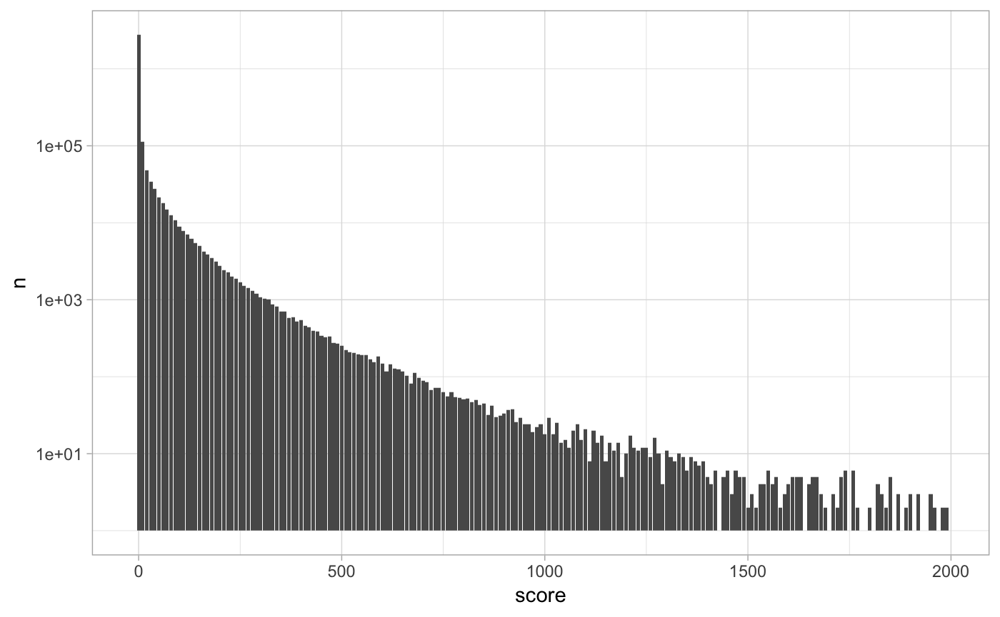

pins: Track, Discover and Share Datasets
================

[](https://travis-ci.org/javierluraschi/pins)
[](https://cran.r-project.org/package=pins)

  - **Track** local and remote datasets using `pin()` and `get_pin()`.
  - **Discover** new datasets from R packages, online and your
    organization using `find_pin()`.
  - **Share** datasets with your team, or the world, using customizable
    boards through `use_board()`.
  - **Extend** storage locations with custom boards, you decide where
    your data lives.

## Installation

You can install `pins` using the `remotes` package:

``` r
install.packages("remotes")
remotes::install_github("javierluraschi/pins")
```

## Tracking Datasets

It’s easy to track local datasets using `pin()` and `get_pin()`. In
addition, you can retrive remote datasets using `DBI` or pin remote
datasets without retrieving them using `dplyr`.

### Local Datasets

You can track your datasets privately by pinning with `pin()`.

``` r
library(dplyr, warn.conflicts = FALSE)
library(pins)

iris %>%
  filter(Sepal.Width < 3, Petal.Width < 1) %>%
  pin("iris-small-width", "A subset of 'iris' with only small widths.")
```

    ## # A tibble: 2 x 5
    ##   Sepal.Length Sepal.Width Petal.Length Petal.Width Species
    ##          <dbl>       <dbl>        <dbl>       <dbl> <fct>  
    ## 1          4.4         2.9          1.4         0.2 setosa 
    ## 2          4.5         2.3          1.3         0.3 setosa

You can then retrieve them back with `get_pin()`.

``` r
get_pin("iris-small-width")
```

    ## # A tibble: 2 x 5
    ##   Sepal.Length Sepal.Width Petal.Length Petal.Width Species
    ##          <dbl>       <dbl>        <dbl>       <dbl> <fct>  
    ## 1          4.4         2.9          1.4         0.2 setosa 
    ## 2          4.5         2.3          1.3         0.3 setosa

A pin is a tool to help you organize your datasets to easily fetch
results from past data analysis sessions.

For instance, once a dataset is tidy, you are likely to reuse it several
times. You might also have a past analysis in GitHub, but you might not
want to clone, install dependencies and rerun your code just to access
your dataset. Another use case is to cross-join between datasets to
analyse across multiple projects or help you remember which datasets
you’ve used in the past.

### Remote Datasets

Some datasets are stored in datasets which you usually access with `DBI`
or `dplyr`. For instance, you might want to access a public dataset
stored in
`bigrquery`:

``` r
con <- DBI::dbConnect(bigrquery::bigquery(), project = bq_project, dataset = bq_dataset)
```

Which we can analyze with `DBI` and then pin the results locally:

``` r
DBI::dbGetQuery(con, "
  SELECT score, count(*) as n
  FROM (SELECT 10 * floor(score/10) as score FROM `bigquery-public-data.hacker_news.full`)
  GROUP BY score") %>%
  pin("hacker-news-scores", "Hacker News scores grouped by tens.")
```

However, you can only use `DBI` when you can fetch all the data back
into R, this is not feasible in many cases. Instead, when using `dplyr`,
you can pin large datasets and transform them without having to fetch
any data at all.

Lets pin the entire dataset using `dplyr`:

``` r
tbl(con, "bigquery-public-data.hacker_news.full") %>%
  pin("hacker-news-full")
```

    ## # Source:   SQL [?? x 14]
    ## # Database: BigQueryConnection
    ##    by    score   time timestamp           title type  url   text  parent
    ##    <chr> <int>  <int> <dttm>              <chr> <chr> <chr> <chr>  <int>
    ##  1 user…    NA 1.49e9 2017-03-19 17:22:04 ""    comm… ""    &gt;… 1.39e7
    ##  2 ange…    NA 1.46e9 2016-02-25 03:48:40 ""    comm… ""    I re… 1.12e7
    ##  3 md2be    NA 1.52e9 2018-01-18 16:22:27 ""    comm… ""    Imag… 1.62e7
    ##  4 radl…    NA 1.21e9 2008-07-01 21:30:11 ""    comm… ""    "<a … 2.33e5
    ##  5 pmon…    NA 1.48e9 2016-12-02 15:56:20 ""    comm… ""    "No … 1.31e7
    ##  6 dmix     NA 1.35e9 2012-08-18 00:01:42 ""    comm… ""    "I t… 4.40e6
    ##  7 Alre…    NA 1.43e9 2015-04-29 12:25:07 ""    comm… ""    I ag… 9.46e6
    ##  8 danso    NA 1.52e9 2018-04-19 14:16:30 ""    comm… ""    You … 1.69e7
    ##  9 meric    NA 1.45e9 2015-11-19 01:46:16 ""    comm… ""    Is i… 1.06e7
    ## 10 offy…    NA 1.26e9 2009-10-27 21:41:03 ""    comm… ""    "We'… 9.02e5
    ## # … with more rows, and 5 more variables: deleted <lgl>, dead <lgl>,
    ## #   descendants <int>, id <int>, ranking <int>

This works well if you provide the connection, after your R session gets
restarted, you would have to provide a connection yourself before
retrieving the
pin:

``` r
con <- DBI::dbConnect(bigrquery::bigquery(), project = bq_project, dataset = bq_dataset)
get_pin("hacker-news-full")
```

This is acceptable but not ideal – it’s hard to remember what connection
to use for each dataset. So instead, pin a
connection:

``` r
con <- pin(~DBI::dbConnect(bigrquery::bigquery(), project = bq_project, dataset = bq_dataset), "bigquery")
```

Then pin your dataset as you would usually
would,

``` r
tbl(con, "bigquery-public-data.hacker_news.full") %>% pin("hacker-news-full")
```

From now on, after restarting your R session and retrieving the pin, the
pin will initialize the connection before retrieving a `dplyr` reference
to it with `pin("hacker-news-full")`.

Which in turn, allows you to further process the datset using `dplyr`
and pin additional remote datasets.

``` r
get_pin("hacker-news-full") %>%
  transmute(score = 10 * floor(score/10)) %>%
  group_by(score) %>%
  summarize(n = n()) %>%
  filter(score < 2000) %>%
  pin("hacker-news-scores")
```

You can then use this `dplyr` pin to process data further; for instance,
by visualizing it with ease:

``` r
library(ggplot2)

get_pin("hacker-news-scores") %>%
  ggplot() +
    geom_bar(aes(x = score, y = n), stat="identity") +
    scale_y_log10() + theme_light()
```

<!-- -->

You can also cache this dataset locally by running `collect()` on the
pin and then re-pinning it with `pin()`.

## Discovering Datasets

The `pins` package can help you discover interesting datasets, currently
it searches datasets inside CRAN packages but we are planning to extend
this further.

You can search datasets that contain “seattle” in their description or name
as follows:

``` r
find_pin("seattle")
```

    ## # A tibble: 4 x 3
    ##   name           description                                         board 
    ##   <fct>          <fct>                                               <chr> 
    ## 1 seattle_sales  Seattle Home Sales from hpiR package.               packa…
    ## 2 seattledmi     Data for a crime intervention in Seattle, Washingt… packa…
    ## 3 data_seattle_… Example dataset: Seattle daily weather from vegawi… packa…
    ## 4 data_seattle_… Example dataset: Seattle hourly temperatures from … packa…

You can the retrieve a specific dataset with `get_pin()`:

``` r
get_pin("seattle_sales")
```

    ## # A tibble: 43,313 x 16
    ##    pinx  sale_id sale_price sale_date  use_type  area lot_sf  wfnt
    ##    <chr> <chr>        <int> <date>     <chr>    <int>  <int> <dbl>
    ##  1 ..00… 2013..…     289000 2013-02-06 sfr         79   9295     0
    ##  2 ..00… 2013..…     356000 2013-07-11 sfr         18   6000     0
    ##  3 ..00… 2010..…     333500 2010-12-29 sfr         79   7200     0
    ##  4 ..00… 2016..…     577200 2016-03-17 sfr         79   7200     0
    ##  5 ..00… 2012..…     237000 2012-05-02 sfr         79   5662     0
    ##  6 ..00… 2014..…     347500 2014-03-11 sfr         79   5830     0
    ##  7 ..00… 2012..…     429000 2012-09-20 sfr         18  12700     0
    ##  8 ..00… 2015..…     653295 2015-07-21 sfr         79   7000     0
    ##  9 ..00… 2014..…     427650 2014-02-19 townhou…    79   3072     0
    ## 10 ..00… 2015..…     488737 2015-03-19 townhou…    79   3072     0
    ## # … with 43,303 more rows, and 8 more variables: bldg_grade <int>,
    ## #   tot_sf <int>, beds <int>, baths <dbl>, age <int>, eff_age <int>,
    ## #   longitude <dbl>, latitude <dbl>

## Sharing Datasets

`pins` supports shared storage locations using boards. A board is a
remote location for you to share pins with your team privately, or with
the world, publicly. Use `use_board()` to choose a board, currently only
databases are supported; however, `pins` provide an extensible API you
can use to store pins anywhere.

### Databases

We can reuse our `bigrquery` connection to define a database-backed
shared board,

``` r
use_board("database", con)
```

Which we can also use to pin a dataset,

``` r
pin(iris, "iris", "The entire 'iris' dataset.")
```

    ## # A tibble: 150 x 5
    ##    Species    Petal_Width Petal_Length Sepal_Width Sepal_Length
    ##    <chr>            <dbl>        <dbl>       <dbl>        <dbl>
    ##  1 versicolor         1.1          3           2.5          5.1
    ##  2 versicolor         1            3.5         2            5  
    ##  3 versicolor         1            3.5         2.6          5.7
    ##  4 versicolor         1            4           2.2          6  
    ##  5 versicolor         1.2          4           2.6          5.8
    ##  6 versicolor         1.3          4           2.3          5.5
    ##  7 versicolor         1.3          4           2.8          6.1
    ##  8 versicolor         1.3          4           2.5          5.5
    ##  9 versicolor         1.5          4.5         3.2          6.4
    ## 10 versicolor         1.5          4.5         3            5.6
    ## # … with 140 more rows

find pins,

``` r
find_pin()
```

    ## # A tibble: 1 x 3
    ##   name  description                board   
    ##   <chr> <chr>                      <chr>   
    ## 1 iris  The entire 'iris' dataset. database

and retrieve shared datasets.

``` r
get_pin("iris")
```

    ## # A tibble: 150 x 5
    ##    Species    Petal_Width Petal_Length Sepal_Width Sepal_Length
    ##    <chr>            <dbl>        <dbl>       <dbl>        <dbl>
    ##  1 versicolor         1.1          3           2.5          5.1
    ##  2 versicolor         1            3.5         2            5  
    ##  3 versicolor         1            3.5         2.6          5.7
    ##  4 versicolor         1            4           2.2          6  
    ##  5 versicolor         1.2          4           2.6          5.8
    ##  6 versicolor         1.3          4           2.3          5.5
    ##  7 versicolor         1.3          4           2.8          6.1
    ##  8 versicolor         1.3          4           2.5          5.5
    ##  9 versicolor         1.5          4.5         3.2          6.4
    ## 10 versicolor         1.5          4.5         3            5.6
    ## # … with 140 more rows
