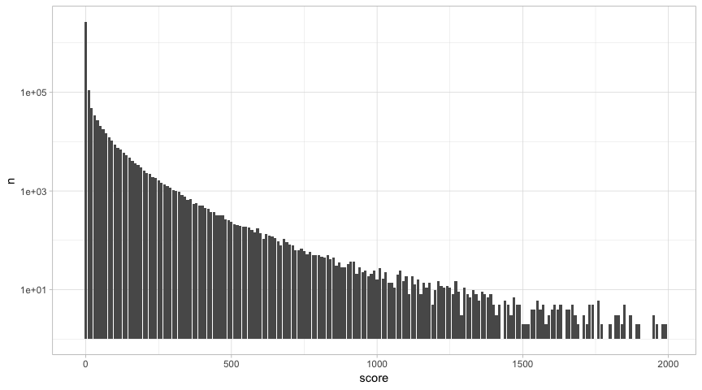

pins: manage, discover and share datasets in R.
================

[](https://travis-ci.org/javierluraschi/pins)
[](https://cran.r-project.org/package=pins)

  - **Manage** your personal datasets by pinning and retrieving them
    with `pin()`.
  - **Discover** new datasets from R packages, online and in your
    organization using `find_pin()`.
  - **Share** existing **datasets** online and within your organization
    using `publish_pin()`.
  - **Extend** storage locations using **boards** through `use_board()`,
    you decide where your data lives.

## Installation

You can install `pins` using the `remotes` package:

``` r
install.packages("remotes")
remotes::install_github("javierluraschi/pins")
```

## Private pins

You can track your datasets privately by pinning them as follows:

``` r
library(dplyr, warn.conflicts = FALSE)
library(pins)

iris %>%
  filter(Sepal.Width < 3, Petal.Width < 1) %>%
  pin("iris-small-width", "A subset of 'iris' with only small widths.")
```

    ##   Sepal.Length Sepal.Width Petal.Length Petal.Width Species
    ## 1          4.4         2.9          1.4         0.2  setosa
    ## 2          4.5         2.3          1.3         0.3  setosa

You can then use this dataset as,

``` r
pin("iris-small-width")
```

    ##   Sepal.Length Sepal.Width Petal.Length Petal.Width Species
    ## 1          4.4         2.9          1.4         0.2  setosa
    ## 2          4.5         2.3          1.3         0.3  setosa

A pin is a tool to help you organize content, not the content itself.
Therefore, you should not use a pin to store your findings; instead, you
should still persist files or check-in reproducible code into GitHub.
Pins are here to help retrieve and find datasets.

The motivation behind pinning is to allow you to easily fetch results
from past data analysis sessions. This can be useful after tidying your
data, since once a dataset is tidy you are likely to reuse this several
times and. You might also have a past analysis in GitHub, but you might
not want to clone, install dependencies and rerun your code just to
access your dataset, that’s another good case for using a pin. Another
use case is to cross-join between datasets to analyse across multiple
projects or help you remember which datasets you’ve used in the past.

You can find previous datasets using `find_pin()`:

``` r
find_pin()
```

    ##               name                                description
    ## 1 iris-small-width A subset of 'iris' with only small widths.

### Databases

Some datasets are stored in datasets which you usually access with `DBI`
and `dplyr`. Let’s access a public dataset stored in
`bigrquery`:

``` r
con <- DBI::dbConnect(bigrquery::bigquery(), project = bq_project, dataset = bq_dataset)
```

Which we can analyze and pin with
`DBI`:

``` r
DBI::dbGetQuery(con, "SELECT score, count(*) as n FROM (SELECT 10 * floor(score/10) as score FROM `bigquery-public-data.hacker_news.full` WHERE score <= 2000) GROUP BY score") %>%
  pin("hacker-news-scores", "Hacker News scores grouped by tens.")
```

    ## # A tibble: 193 x 2
    ##    score       n
    ##    <dbl>   <int>
    ##  1     0 2680782
    ##  2   250    1620
    ##  3   510     209
    ##  4   260    1467
    ##  5    10  109811
    ##  6   520     201
    ##  7  1040      14
    ##  8   270    1378
    ##  9    20   47378
    ## 10    30   33733
    ## # … with 183 more rows

Which we could then use at a later time to experiment with plots and
avoid rerunning this query after our session restarts:

``` r
library(ggplot2)

pin("hacker-news-scores") %>%
  ggplot() + geom_bar(aes(x = score, y = n), stat="identity") + scale_y_log10() + theme_light()
```

<!-- -->

However, you can only using `DBI` when you can fetch all the data back
in R; instead, when using `dplyr`, you can pin large datasets and
transform them without having to fetch any data at all. For instance,
lets pin the entire dataset using
`dplyr`:

``` r
tbl(con, "bigquery-public-data.hacker_news.full") %>% pin("hacker-news-full")
```

    ## # Source:   SQL [?? x 14]
    ## # Database: BigQueryConnection
    ##    by    score   time timestamp           title type  url   text  parent
    ##    <chr> <int>  <int> <dttm>              <chr> <chr> <chr> <chr>  <int>
    ##  1 user…    NA 1.49e9 2017-03-19 17:22:04 ""    comm… ""    &gt;… 1.39e7
    ##  2 ange…    NA 1.46e9 2016-02-25 03:48:40 ""    comm… ""    I re… 1.12e7
    ##  3 md2be    NA 1.52e9 2018-01-18 16:22:27 ""    comm… ""    Imag… 1.62e7
    ##  4 radl…    NA 1.21e9 2008-07-01 21:30:11 ""    comm… ""    "<a … 2.33e5
    ##  5 pmon…    NA 1.48e9 2016-12-02 15:56:20 ""    comm… ""    "No … 1.31e7
    ##  6 dmix     NA 1.35e9 2012-08-18 00:01:42 ""    comm… ""    "I t… 4.40e6
    ##  7 Alre…    NA 1.43e9 2015-04-29 12:25:07 ""    comm… ""    I ag… 9.46e6
    ##  8 danso    NA 1.52e9 2018-04-19 14:16:30 ""    comm… ""    You … 1.69e7
    ##  9 meric    NA 1.45e9 2015-11-19 01:46:16 ""    comm… ""    Is i… 1.06e7
    ## 10 offy…    NA 1.26e9 2009-10-27 21:41:03 ""    comm… ""    "We'… 9.02e5
    ## # … with more rows, and 5 more variables: deleted <lgl>, dead <lgl>,
    ## #   descendants <int>, id <int>, ranking <int>

This works well if you provide the connection, after your R session gets
restarted, you would have to provide a connection yourself before
retrieving the
pin:

``` r
con <- DBI::dbConnect(bigrquery::bigquery(), project = bq_project, dataset = bq_dataset)
pin("hacker-news-full")
```

    ## # Source:   SQL [?? x 14]
    ## # Database: BigQueryConnection
    ##    by    score   time timestamp           title type  url   text  parent
    ##    <chr> <int>  <int> <dttm>              <chr> <chr> <chr> <chr>  <int>
    ##  1 user…    NA 1.49e9 2017-03-19 17:22:04 ""    comm… ""    &gt;… 1.39e7
    ##  2 ange…    NA 1.46e9 2016-02-25 03:48:40 ""    comm… ""    I re… 1.12e7
    ##  3 md2be    NA 1.52e9 2018-01-18 16:22:27 ""    comm… ""    Imag… 1.62e7
    ##  4 radl…    NA 1.21e9 2008-07-01 21:30:11 ""    comm… ""    "<a … 2.33e5
    ##  5 pmon…    NA 1.48e9 2016-12-02 15:56:20 ""    comm… ""    "No … 1.31e7
    ##  6 dmix     NA 1.35e9 2012-08-18 00:01:42 ""    comm… ""    "I t… 4.40e6
    ##  7 Alre…    NA 1.43e9 2015-04-29 12:25:07 ""    comm… ""    I ag… 9.46e6
    ##  8 danso    NA 1.52e9 2018-04-19 14:16:30 ""    comm… ""    You … 1.69e7
    ##  9 meric    NA 1.45e9 2015-11-19 01:46:16 ""    comm… ""    Is i… 1.06e7
    ## 10 offy…    NA 1.26e9 2009-10-27 21:41:03 ""    comm… ""    "We'… 9.02e5
    ## # … with more rows, and 5 more variables: deleted <lgl>, dead <lgl>,
    ## #   descendants <int>, id <int>, ranking <int>

This is acceptable but not ideal – it’s hard to remember what connection
to use for each dataset. So instead, pin a
connection:

``` r
con <- pin(~DBI::dbConnect(bigrquery::bigquery(), project = bq_project, dataset = bq_dataset), "bigquery")
```

Then pin your dataset as you would usually
would,

``` r
tbl(con, "bigquery-public-data.hacker_news.full") %>% pin("hacker-news-full")
```

    ## # Source:   SQL [?? x 14]
    ## # Database: BigQueryConnection
    ##    by    score   time timestamp           title type  url   text  parent
    ##    <chr> <int>  <int> <dttm>              <chr> <chr> <chr> <chr>  <int>
    ##  1 MrMe…    NA 1.36e9 2013-03-03 23:04:40 ""    comm… ""    "The… 5.32e6
    ##  2 elor…    NA 1.44e9 2015-07-09 16:39:07 ""    comm… ""    We d… 9.86e6
    ##  3 rlpb     NA 1.27e9 2010-04-29 06:02:03 ""    comm… ""    It's… 1.30e6
    ##  4 jboy…    NA 1.46e9 2016-04-19 07:54:35 ""    comm… ""    "Sli… 1.15e7
    ##  5 nivs…    NA 1.37e9 2013-05-22 12:10:05 ""    comm… ""    Noth… 5.75e6
    ##  6 RexR…    NA 1.44e9 2015-09-17 00:15:00 ""    comm… ""    It w… 1.02e7
    ##  7 Estr…    NA 1.24e9 2009-06-07 13:50:13 ""    comm… ""    Ther… 6.46e5
    ##  8 stre…    NA 1.30e9 2011-03-25 13:43:20 ""    comm… ""    TLDR… 2.37e6
    ##  9 dman     NA 1.38e9 2013-08-08 22:40:08 ""    comm… ""    Whis… 6.18e6
    ## 10 tedu…    NA 1.54e9 2018-09-18 19:05:30 ""    comm… ""    Seem… 1.80e7
    ## # … with more rows, and 5 more variables: deleted <lgl>, dead <lgl>,
    ## #   descendants <int>, id <int>, ranking <int>

From now on, after restarting your R session and retrieving the pin, the
pin will initialize the connection before retrieving a `dplyr` reference
to it:

``` r
pin("hacker-news-full")
```

    ## # Source:   SQL [?? x 14]
    ## # Database: BigQueryConnection
    ##    by    score   time timestamp           title type  url   text   parent
    ##    <chr> <int>  <int> <dttm>              <chr> <chr> <chr> <chr>   <int>
    ##  1 walt…     8 1.44e9 2015-08-10 06:38:36 HTC … story http… ""    NA     
    ##  2 _ran…    NA 1.39e9 2013-11-27 22:18:04 ""    comm… ""    Some…  6.81e6
    ##  3 prit…    NA 1.42e9 2015-02-04 18:50:36 ""    comm… ""    Look…  9.00e6
    ##  4 nick…    NA 1.48e9 2016-10-28 23:46:34 ""    comm… ""    "Fro…  1.28e7
    ##  5 happ…     2 1.50e9 2017-07-01 13:29:09 To S… story http… ""    NA     
    ##  6 devx…    NA 1.53e9 2018-08-10 05:07:22 ""    comm… ""    "<a …  1.77e7
    ##  7 fath…    NA 1.43e9 2015-04-13 12:15:12 ""    comm… ""    "Not…  9.37e6
    ##  8 myli…    NA 1.47e9 2016-09-01 20:54:24 ""    comm… ""    "Shi…  1.24e7
    ##  9 pjmlp    NA 1.51e9 2017-09-14 13:17:59 ""    comm… ""    Sure…  1.52e7
    ## 10 eli      NA 1.31e9 2011-06-06 21:28:28 ""    comm… ""    "<i>…  2.63e6
    ## # … with more rows, and 5 more variables: deleted <lgl>, dead <lgl>,
    ## #   descendants <int>, id <int>, ranking <int>

Which in turn, allows you to further process the datset using `dplyr`
and pin additional remote datasets.

``` r
pin("hacker-news-full") %>%
  transmute(score = 10 * floor(score/10)) %>%
  group_by(score) %>% summarize(n = n()) %>%
  pin("hacker-news-scores")
```

    ## # Source:   SQL [?? x 2]
    ## # Database: BigQueryConnection
    ##    score       n
    ##    <dbl>   <int>
    ##  1     0 2680782
    ##  2   250    1620
    ##  3   510     209
    ##  4   260    1467
    ##  5    10  109811
    ##  6   520     201
    ##  7  1040      14
    ##  8   270    1378
    ##  9    20   47378
    ## 10    30   33733
    ## # … with more rows

To store this pin locally, you can retrieve it, collect it, and re-pin
it.

``` r
pin("hacker-news-scores") %>%
  collect() %>%
  pin("hacker-news-scores")
```

    ## # A tibble: 253 x 2
    ##    score       n
    ##    <dbl>   <int>
    ##  1     0 2680782
    ##  2   250    1620
    ##  3   510     209
    ##  4   260    1467
    ##  5    10  109811
    ##  6   520     201
    ##  7  1040      14
    ##  8   270    1378
    ##  9    20   47378
    ## 10    30   33733
    ## # … with 243 more rows

## Sharing pins

`pins` supports shared storage locations using boards. A board is a
remote location for you to share pins with your team privately, or with
the world, publicly. Use `use_board()` to choose a board, currently only
databases are supported; however, `pins` provide an extensible API you
can use to store pins anywhere.

### Databases

We can reuse our `bigrquery` connection to define a database-backed
shared board,

``` r
use_board("database", con)
```

Which we can also use to pin a dataset,

``` r
pin(iris, "iris", "The entire 'iris' dataset.")
```

    ## # A tibble: 150 x 5
    ##    Species    Petal_Width Petal_Length Sepal_Width Sepal_Length
    ##    <chr>            <dbl>        <dbl>       <dbl>        <dbl>
    ##  1 versicolor         1.1          3           2.5          5.1
    ##  2 versicolor         1            3.5         2            5  
    ##  3 versicolor         1            3.5         2.6          5.7
    ##  4 versicolor         1            4           2.2          6  
    ##  5 versicolor         1.2          4           2.6          5.8
    ##  6 versicolor         1.3          4           2.3          5.5
    ##  7 versicolor         1.3          4           2.8          6.1
    ##  8 versicolor         1.3          4           2.5          5.5
    ##  9 versicolor         1.5          4.5         3.2          6.4
    ## 10 versicolor         1.5          4.5         3            5.6
    ## # … with 140 more rows

find pins,

``` r
find_pin()
```

    ##   name                description
    ## 1 iris The entire 'iris' dataset.

and retrieve shared datasets.

``` r
pin("iris")
```

    ## # A tibble: 150 x 5
    ##    Species    Petal_Width Petal_Length Sepal_Width Sepal_Length
    ##    <chr>            <dbl>        <dbl>       <dbl>        <dbl>
    ##  1 versicolor         1.1          3           2.5          5.1
    ##  2 versicolor         1            3.5         2            5  
    ##  3 versicolor         1            3.5         2.6          5.7
    ##  4 versicolor         1            4           2.2          6  
    ##  5 versicolor         1.2          4           2.6          5.8
    ##  6 versicolor         1.3          4           2.3          5.5
    ##  7 versicolor         1.3          4           2.8          6.1
    ##  8 versicolor         1.3          4           2.5          5.5
    ##  9 versicolor         1.5          4.5         3.2          6.4
    ## 10 versicolor         1.5          4.5         3            5.6
    ## # … with 140 more rows
