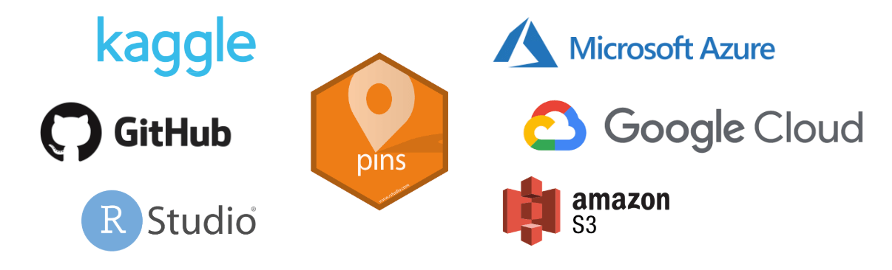
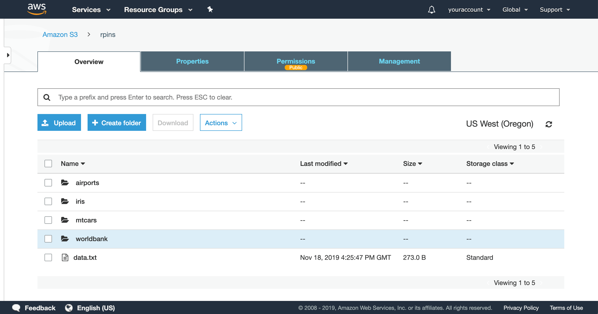

```{r setup, include=FALSE}
knitr::opts_chunk$set(eval = FALSE)
```

A new version of `pins` is available on CRAN! `pins 0.3` comes with many improvements and the following major features:

- Support for new **cloud boards** to pin resources in [Azure](../../../articles/boards-azure.html), [GCloud](../../../articles/boards-gcloud.html) and [S3](../../../articles/boards-s3.html) storage.
- Retrieve **pin information** with `pin_info()` including properties particular to each board.

You can install this new version from CRAN as follows:

```r
install.packages("pins")
```

In addition, there is a new [Use Cases](https://rstudio.github.io/pins/articles/use-cases.html) section in our docs, various improvements (see [NEWS](https://rstudio.github.io/pins/news/index.html)) and two community extensions being developed to support [databases](https://rstudio.github.io/connections/#pins) and [Nextcloud](https://gitlab.com/gwmngilfen/nextcloudr) as boards.

## Cloud Boards

`pins 0.3` adds support to find, retrieve and store resources in various cloud providers like: [Microsoft Azure](https://azure.microsoft.com/), [Google Cloud](https://cloud.google.com/) and [Amazon Web Services](https://aws.amazon.com/).



To illustrate how they work, lets first try to find the World Bank indicators dataset in [Kaggle](https://www.kaggle.com/):

```r
library(pins)
pin_find("indicators", board = "kaggle")
```
```
# A tibble: 6 x 4
  name                                            description                             type  board 
  <chr>                                           <chr>                                   <chr> <chr> 
1 worldbank/world-development-indicators          World Development Indicators            files kaggle
2 theworldbank/world-development-indicators       World Development Indicators            files kaggle
3 cdc/chronic-disease                             Chronic Disease Indicators              files kaggle
4 bigquery/worldbank-wdi                          World Development Indicators (WDI) Data files kaggle
5 rajanand/key-indicators-of-annual-health-survey Health Analytics                        files kaggle
6 loveall/human-happiness-indicators              Human Happiness Indicators              files kaggle
```

Which we can then easily download with `pin_get()`, beware this is a 2GB download:

```r
pin_get("worldbank/world-development-indicators")
```
```
[1] "/.../worldbank/world-development-indicators/Country.csv"     
[2] "/.../worldbank/world-development-indicators/CountryNotes.csv"
[3] "/.../worldbank/world-development-indicators/database.sqlite" 
[4] "/.../worldbank/world-development-indicators/Footnotes.csv"   
[5] "/.../worldbank/world-development-indicators/hashes.txt"      
[6] "/.../worldbank/world-development-indicators/Indicators.csv"  
[7] "/.../worldbank/world-development-indicators/Series.csv"      
[8] "/.../worldbank/world-development-indicators/SeriesNotes.csv" 
```

The `Indicators.csv` file contains all the indicators, so let's load it with [readr](https://readr.tidyverse.org/):

```r
indicators <- pin_get("worldbank/world-development-indicators")[6] |>
  readr::read_csv()
```

Analysing this dataset would be quite interesting; however, this post focuses on how to share this in S3, Google Cloud or Azure storage. More specifically, we will learn how to publish to an [S3 board](../../../articles/boards-s3.html). To publish to other cloud providers, take a look at the [Google Cloud](../../../articles/boards-gcloud.html) and [Azure boards](../../../articles/boards-azure.html) articles.

As you would expect, the first step is to register the S3 board. When using RStudio, you can use the [New Connection](../../../articles/pins-rstudio.html) action to guide you through this process, or you can specify your `key` and `secret` as follows. Please refer to the [S3 board](../../../articles/boards-s3.html) article to understand how to store your credentials securely.

```r
board_register_s3(name = "rpins",
                  bucket  = "rpins",
                  key = "VerySecretKey",
                  secret = "EvenMoreImportantSecret")
```

With the S3 board registered, we can now pin the indicators dataset with `pin()`:

```r
pin(indicators, name = "worldbank/indicators", board = "rpins")
```

That's about it! We can now find and retrieve this dataset from S3 using `pin_find()`, `pin_get()` or view the uploaded resources in the S3 management console:



To make this even easier for others to consume, we can make this S3 bucket public; which means you can now connect to this board without even having to configure S3, making it possible to retrieve this dataset with just one line of R code!

```r
pins::pin_get("worldbank/indicators", "https://rpins.s3.amazonaws.com")
```
```
# A tibble: 5,656,458 x 6
   CountryName CountryCode IndicatorName                          IndicatorCode    Year      Value
   <chr>       <chr>       <chr>                                  <chr>           <dbl>      <dbl>
 1 Arab World  ARB         Adolescent fertility rate (births per… SP.ADO.TFRT      1960    1.34e+2
 2 Arab World  ARB         Age dependency ratio (% of working-ag… SP.POP.DPND      1960    8.78e+1
 3 Arab World  ARB         Age dependency ratio, old (% of worki… SP.POP.DPND.OL   1960    6.63e+0
 4 Arab World  ARB         Age dependency ratio, young (% of wor… SP.POP.DPND.YG   1960    8.10e+1
 5 Arab World  ARB         Arms exports (SIPRI trend indicator v… MS.MIL.XPRT.KD   1960    3.00e+6
 6 Arab World  ARB         Arms imports (SIPRI trend indicator v… MS.MIL.MPRT.KD   1960    5.38e+8
 7 Arab World  ARB         Birth rate, crude (per 1,000 people)   SP.DYN.CBRT.IN   1960    4.77e+1
 8 Arab World  ARB         CO2 emissions (kt)                     EN.ATM.CO2E.KT   1960    5.96e+4
 9 Arab World  ARB         CO2 emissions (metric tons per capita) EN.ATM.CO2E.PC   1960    6.44e-1
10 Arab World  ARB         CO2 emissions from gaseous fuel consu… EN.ATM.CO2E.GF…  1960    5.04e+0
# … with 5,656,448 more rows
```

This works since `pins 0.3` automatically register URLs as a [website board](../../../articles/boards-websites.html) to save you from having to explicitly call `board_register_datatxt()`.

It's also worth mentioning that `pins` stores the dataset using an R native format, which requires only 72MB and loads much faster than the original 2GB dataset.

## Pin Information

Boards like [Kaggle](../../../articles/boards-kaggle.html) and [RStudio Connect](../../../articles/boards-rsconnect.html), store additional information for each pin which you can now easily retrieve with `pin_info()`.

For instance, we can retrieve additional properties from the indicators pin from Kaggle as follows,

```r
pin_info("worldbank/world-development-indicators", board = "kaggle")
```
```
# Source: kaggle<worldbank/world-development-indicators> [files]
# Description: World Development Indicators
# Properties:
#   - id: 23
#   - subtitle: Explore country development indicators from around the world
#   - tags: (ref) business, economics, international relations, business finance...
#   - creatorName: Megan Risdal
#   - creatorUrl: mrisdal
#   - totalBytes: 387054886
#   - url: https://www.kaggle.com/worldbank/world-development-indicators
#   - lastUpdated: 2017-05-01T17:50:44.863Z
#   - downloadCount: 42961
#   - isPrivate: FALSE
#   - isReviewed: TRUE
#   - isFeatured: FALSE
#   - licenseName: World Bank Dataset Terms of Use
#   - ownerName: World Bank
#   - ownerRef: worldbank
#   - kernelCount: 422
#   - topicCount: 7
#   - viewCount: 254379
#   - voteCount: 1121
#   - currentVersionNumber: 2
#   - usabilityRating: 0.7647
#   - extension: zip
```

And from RStudio Connect boards as well,

```r
pin_info("worldnews", board = "rsconnect")
```
```
# Source: rsconnect<jluraschi/worldnews> [table]
# Properties:
#   - id: 6446
#   - guid: 1b9f04c5-ddd4-43ca-8352-98f6f01a7034
#   - access_type: all
#   - url: https://beta.rstudioconnect.com/content/6446/
#   - vanity_url: FALSE
#   - bundle_id: 16216
#   - app_mode: 4
#   - content_category: pin
#   - has_parameters: FALSE
#   - created_time: 2019-09-30T18:20:21.911777Z
#   - last_deployed_time: 2019-11-18T16:00:16.919478Z
#   - build_status: 2
#   - run_as_current_user: FALSE
#   - owner_first_name: Javier
#   - owner_last_name: Luraschi
#   - owner_username: jluraschi
#   - owner_guid: ac498f34-174c-408f-8089-a9f10c630a37
#   - owner_locked: FALSE
#   - is_scheduled: FALSE
#   - rows: 44
#   - cols: 1
```

To retrieve all the extended information when discovering pins, pass `extended = TRUE` to `pin_find()`.

Thank you for reading this post!

Please refer to [rstudio.github.io/pins](https://rstudio.github.io/pins) for detailed documentation, [GitHub](https://github.com/rstudio/pins/issues/new) to file issues or feature requests and [Gitter](https://gitter.im/rstudio/pins) to chat with us about anything else.
