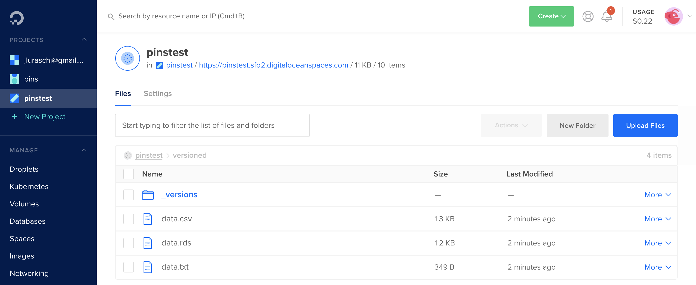

```{r setup, include=FALSE}
knitr::opts_chunk$set(echo = TRUE, eval = FALSE)
```

A new version of `pins` is available on CRAN today, which adds support for [versioning](http://pins.rstudio.com/articles/advanced-versions.html) your datasets and [DigitalOcean Spaces](http://pins.rstudio.com/articles/boards-dospace.html) boards!

As a quick recap, the pins package allows you to cache, discover and share resources. You can use `pins` in a wide range of situations, from downloading a dataset from a URL to creating complex automation workflows (learn more at [pins.rstudio.com](https://pins.rstudio.com)). You can also use `pins` in combination with TensorFlow and Keras; for instance, use [cloudml](https://tensorflow.rstudio.com/tools/cloudml) to train models in cloud GPUs, but rather than manually copying files into the GPU instance, you can store them as pins directly from R.

To install this new version of `pins` from CRAN, simply run:

```r
install.packages("pins")
```

You can find a detailed list of improvements in the pins [NEWS](https://github.com/rstudio/pins/blob/master/NEWS.md) file.

# Versioning

To illustrate the new versioning functionality, let's start by downloading and caching a remote dataset with pins. For this example, we will download the weather in London, this happens to be in JSON format and requires `jsonlite` to be parsed:

```r
library(pins)

weather_url <- "https://samples.openweathermap.org/data/2.5/weather?q=London,uk&appid=b6907d289e10d714a6e88b30761fae22"

pin(weather_url, "weather") |>
  jsonlite::read_json() |>
  as.data.frame()
```
```
  coord.lon coord.lat weather.id weather.main     weather.description weather.icon
1     -0.13     51.51        300      Drizzle light intensity drizzle          09d
```

One advantage of using `pins` is that, even if the URL or your internet connection becomes unavailable, the above code will still work.

But back to `pins 0.4`! The new `signature` parameter in `pin_info()` allows you to retrieve the "version" of this dataset:

```r
pin_info("weather", signature = TRUE)
```
```
# Source: local<weather> [files]
# Signature: 624cca260666c6f090b93c37fd76878e3a12a79b
# Properties:
#   - path: weather
```

You can then validate the remote dataset has not changed by specifying its signature:

```r
pin(weather_url, "weather", signature = "624cca260666c6f090b93c37fd76878e3a12a79b") |>
  jsonlite::read_json()
```

If the remote dataset changes, `pin()` will fail and you can take the appropriate steps to accept the changes by updating the signature or properly updating your code. The previous example is useful as a way of detecting version changes, but we might also want to retrieve specific versions even when the dataset changes.

`pins 0.4` allows you to display and retrieve versions from services like GitHub, Kaggle and RStudio Connect. Even in boards that don't support versioning natively, you can opt-in by registering a board with `versions = TRUE`.

To keep this simple, let's focus on GitHub first. We will register a GitHub board and pin a dataset to it. Notice that you can also specify the `commit` parameter in GitHub boards as the commit message for this change.

```r
board_register_github(repo = "javierluraschi/datasets", branch = "datasets")

pin(iris, name = "versioned", board = "github", commit = "use iris as the main dataset")
```

Now suppose that a colleague comes along and updates this dataset as well:

```r
pin(mtcars, name = "versioned", board = "github", commit = "slight preference to mtcars")
```

From now on, your code could be broken or, even worse, produce incorrect results!

However, since GitHub was designed as a version control system and `pins 0.4` adds support for `pin_versions()`, we can now explore particular versions of this dataset:

```r
pin_versions("versioned", board = "github")
```
```
# A tibble: 2 x 4
  version created              author         message                     
  <chr>   <chr>                <chr>          <chr>                       
1 6e6c320 2020-04-02T21:28:07Z javierluraschi slight preference to mtcars 
2 01f8ddf 2020-04-02T21:27:59Z javierluraschi use iris as the main dataset
```

You can then retrieve the version you are interested in as follows:

```r
pin_get("versioned", version = "01f8ddf", board = "github")
```
```
# A tibble: 150 x 5
   Sepal.Length Sepal.Width Petal.Length Petal.Width Species
          <dbl>       <dbl>        <dbl>       <dbl> <fct>  
 1          5.1         3.5          1.4         0.2 setosa 
 2          4.9         3            1.4         0.2 setosa 
 3          4.7         3.2          1.3         0.2 setosa 
 4          4.6         3.1          1.5         0.2 setosa 
 5          5           3.6          1.4         0.2 setosa 
 6          5.4         3.9          1.7         0.4 setosa 
 7          4.6         3.4          1.4         0.3 setosa 
 8          5           3.4          1.5         0.2 setosa 
 9          4.4         2.9          1.4         0.2 setosa 
10          4.9         3.1          1.5         0.1 setosa 
# … with 140 more rows
```

You can follow similar steps for [RStudio Connect](http://pins.rstudio.com/articles/boards-rsconnect.html) and [Kaggle](http://pins.rstudio.com/articles/boards-kaggle.html) boards, even for existing pins! Other boards like [Amazon S3](http://pins.rstudio.com/articles/boards-s3.html), [Google Cloud](http://pins.rstudio.com/articles/boards-gcloud.html), [Digital Ocean](http://pins.rstudio.com/articles/boards-dospace.html) and [Microsoft Azure](http://pins.rstudio.com/articles/boards-azure.html) require you explicitly enable versioning when registering your boards.

# DigitalOcean

To try out the new [DigitalOcean Spaces board](http://pins.rstudio.com/articles/boards-dospace.html), first you will have to register this board and enable versioning by setting `versions` to `TRUE`:

```r
library(pins)
board_register_dospace(space = "pinstest",
                       key = "AAAAAAAAAAAAAAAAAAAA",
                       secret = "ABCABCABCABCABCABCABCABCABCABCABCABCABCA==",
                       datacenter = "sfo2",
                       versions = TRUE)
```

You can then use all the functionality pins provides, including versioning:

```r
# create pin and replace content in digitalocean
pin(iris, name = "versioned", board = "pinstest")
pin(mtcars, name = "versioned", board = "pinstest")

# retrieve versions from digitalocean
pin_versions(name = "versioned", board = "pinstest")
```
```
# A tibble: 2 x 1
  version
  <chr>  
1 c35da04
2 d9034cd
```

Notice that enabling versions in cloud services requires additional storage space for each version of the dataset being stored:

{width=100%}

To learn more visit the [Versioning](http://pins.rstudio.com/articles/advanced-versions.html) and [DigitalOcean](http://pins.rstudio.com/articles/boards-dospace.html) articles. To catch up with previous releases:

- [pins 0.3](http://pins.rstudio.com/blog/posts/pins-0-3-0/): Azure, GCloud and S3
- [pins 0.2](https://blog.rstudio.com/2019/09/09/pin-discover-and-share-resources/): Pin, Discover and Share Resources

Thanks for reading along!


