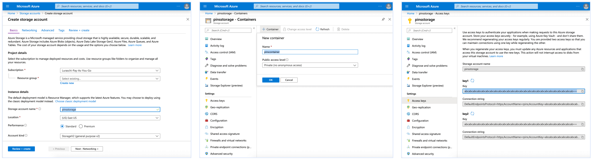
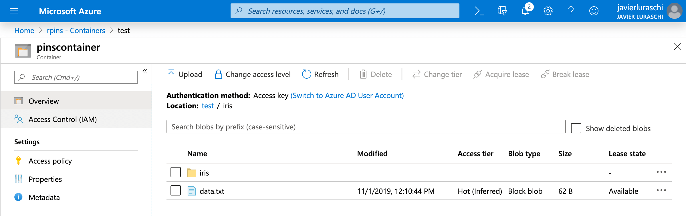

```{r setup, echo=FALSE}
library(pins)
```

## Registering

In order to use Microsoft Azure Storage as a [board](boards-understanding.html), you need an Azure Storage account, an Azure Storage container, and an Azure Storage key. You can sign-up and create those from [portal.azure.com](https://portal.azure.com):



You can then use the Azure Storage conatiner, account, and key to authenticate:

```{r eval=FALSE}
board_register_azure(container = "pinscontainer",
                     account = "pinsstorage",
                     key = "ABCABCABCABCABCABCABCABCABCAB==")
```

Notice that `board_register_azure()` is just an alias with named parameters to `board_register()`; the previous code is equivalent to:

```{r eval=FALSE}
board_register("azure", container = "pinscontainer",
                        account = "pinsstorage",
                        key = "ABCABCABCABCABCABCABCABCABCAB==")
```

Once the board is registered, you can pin and search using `pin()`, `pin_get()` and `pin_find()`.

## Pinning

Like in other boards, you can create pins for `iris` and `mtcars` by setting `board` to Azure's board name,

```{r eval=FALSE}
pin(iris, description = "The iris data set", board = "azure")
pin(mtcars, description = "The motor trend cars data set", board = "azure")
```

After a pin is created, the pin also becomes available in the Azure's dataset website; by default, they are created as private datasets.

{width=480px}

You can also retrieve pins back from this repo using the now familiar `pin_get()` function. 

```{r eval=FALSE}
pin_get("iris", board = "azure")
```
```
# A tibble: 150 x 5
   Sepal.Length Sepal.Width Petal.Length Petal.Width Species
          <dbl>       <dbl>        <dbl>       <dbl> <fct>  
 1          5.1         3.5          1.4         0.2 setosa 
 2          4.9         3            1.4         0.2 setosa 
 3          4.7         3.2          1.3         0.2 setosa 
 4          4.6         3.1          1.5         0.2 setosa 
 5          5           3.6          1.4         0.2 setosa 
 6          5.4         3.9          1.7         0.4 setosa 
 7          4.6         3.4          1.4         0.3 setosa 
 8          5           3.4          1.5         0.2 setosa 
 9          4.4         2.9          1.4         0.2 setosa 
10          4.9         3.1          1.5         0.1 setosa 
# … with 140 more rows
```

Notice you can also retrieve an arbitrary file using the path to the file or its URL as well:

```{r eval=FALSE, echo=FALSE}
pin_get("https://pinsstorage.blob.core.windows.net/pinscontainer/iris/data.csv", board = "azure")
```
```{r eval=FALSE}
pin_get("iris/data.csv", board = "azure")
```

## Discovering

You can then search pins in your Azure board using `pin_find()`, which by default search all boards but you can also explicitly request to use this particular board:

```{r eval=FALSE}
pin_find("data", board = "azure")
```
```
# A tibble: 2 x 4
  name   description                   type  board
  <chr>  <chr>                         <chr> <chr>
1 iris   The iris data set             table azure
2 mtcars The motor trend cars data set table azure
```

Notice that the given 'data' search keyword is searched in the name and description fields for the pins available in this repo.
