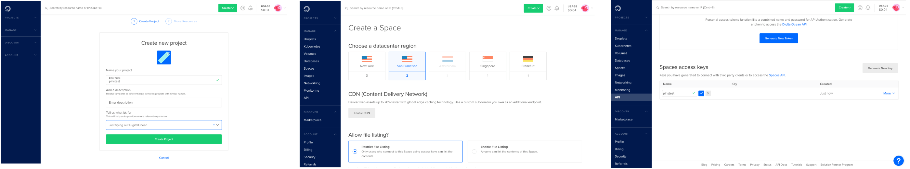

```{r setup, echo=FALSE}
library(pins)
```

## Registering

In order to use DigitalOcean Spaces as a [board](boards-understanding.html), you need an DigitalOcean space and a storage key. You can sign-up and create those from [digitalocean.com](https://www.digitalocean.com/).



You can then use the DigitalOcean space, key, secret, and datacenter to authenticate:

```{r eval=FALSE}
board_register_dospace(space = "pinstest",
                       key = "AAAAAAAAAAAAAAAAAAAA",
                       secret = "ABCABCABCABCABCABCABCABCABCABCABCABCABCA==",
                       datacenter = "sfo2")
```

Notice that `board_register_dospace()` is just an alias with named parameters to `board_register()`; the previous code is equivalent to:

```{r eval=FALSE}
board_register("dospace", space = "pinstest",
                          key = "AAAAAAAAAAAAAAAAAAAA",
                          secret = "ABCABCABCABCABCABCABCABCABCABCABCABCABCA==",
                          datacenter = "sfo2")
```

Once the board is registered, you can pin and search using `pin()`, `pin_get()` and `pin_find()`.
