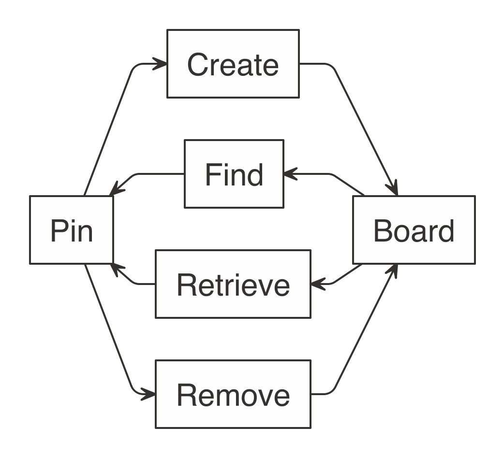

The GitHub, Kaggle, RStudio Connect and Website boards provide access to popular Data Science storage services; however, there can be many other interesting services to store resources through pins. For instance, Amazon S3, Amazon Glacier, Azure Blobs, Google File System and Hadoop, just to name a few. While those are not natively implemented in the `pins` package, you can create packages that extend `pins` to support many other services through custom boards.

For the purpose of creating custom boards, it helps to understand a board as a collection of files stored with a given name. It closely resembles a simple file systems, but it only requires the following operations to be implemented: create, get, find and remove. For read-only storage locations, you can also decide to implement only the 'get' and 'find' operations.

```{r eval=FALSE, echo=FALSE}
nomnoml::nomnoml("
#padding: 10
#spacing: 22
[Pin]->[Create]
[Create]->[Board]
[Pin]<-[Find]
[Find]<-[Board]
[Pin]<-[Retrieve]
[Retrieve]<-[Board]
[Pin]->[Remove]
[Remove]->[Board]", "images/boards-extending-overview.png")
```
{width=50%}

The most important S3 methods that your board needs to support are `board_pin_create()`, `board_pin_get()`, `board_pin_find()` and `board_pin_remove()` which define how to create, get, find and remove a pin.

The next S3 method to consider implementing is `board_initialize()` which is optional to implement but provides support for initialization, this method usually deals with authentication.

The last function to consider implementing is `board_browse()`, this function is used to browse to the location of the board. Usually implemented by calling `browseURL()` to open to website of the service hosting the custom board.

To make this a bit more clear, the following section implements a custom board based on folders.

## Example

The following example creates a simple folder-based board, which stores pins in local folders, this is similar to the default 'local' board. It is advisable to create an R package that provides these methods, but you can also define them in a plain R script:

```{r}
board_initialize.folder <- function(board, ...) {
  if (!dir.exists("pins")) dir.create("pins")
  board
}

board_pin_create.folder <- function(board, path, name, ...) {
  dir.create(file.path("pins", name), recursive = TRUE, showWarnings = FALSE)
  file.copy(dir(path, full.names = TRUE), file.path("pins", name), recursive = TRUE)
}

board_pin_get.folder <- function(board, name, ...) {
  file.path("pins", name)
}

board_pin_find.folder <- function(board, text, ...) {
  data.frame(name = dir("pins", text), stringsAsFactors = F)
}

board_pin_remove.folder <- function(board, name, ...) {
  unlink(file.path("pins", name), recursive = TRUE)
}
```
