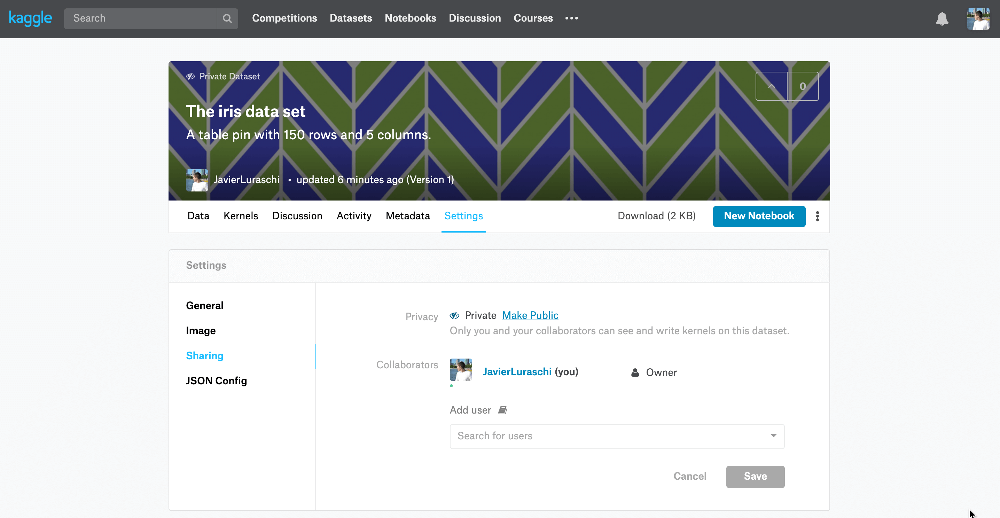

```{r setup, echo=FALSE}
library(pins)
```

## Registering

In order to use Kaggle as a [board](boards-understanding.html), you need to authenticate first by creating a token file from [kaggle.com/me/account](https://www.kaggle.com/me/account). 

```{r eval=FALSE}
board_register_kaggle(token = "path/to/kaggle.json")
```

Notice that `board_register_kaggle()` is just an alias with named parameters to `board_register()`; the previous code is equivalent to:

```{r eval=FALSE}
board_register("kaggle", token = "path/to/kaggle.json")
```

Once the board is registered, you can pin and search using `pin()`, `pin_get()` and `pin_find()`.

## Pinning

Like in other boards, you can create pins for `iris` and `mtcars` by setting `board` to Kaggle's board name,

```{r eval=FALSE}
pin(iris, description = "The iris data set", board = "kaggle")
pin(mtcars, description = "The motor trend cars data set", board = "kaggle")
```

After a pin is created, the pin also becomes available in the Kaggle's dataset website; by defeault, they are created as private datasets.

{width=480px}

You can also retrieve pins back from this repo using the now familiar `pin_get()` function. However, since Kaggle names require at least six characters, `pins` appends `-pin` to names that are shorter than Kaggle's required size.

```{r eval=FALSE}
pin_get("iris-pin", board = "kaggle")
```
```
# A tibble: 150 x 5
   Sepal.Length Sepal.Width Petal.Length Petal.Width Species
          <dbl>       <dbl>        <dbl>       <dbl> <fct>  
 1          5.1         3.5          1.4         0.2 setosa 
 2          4.9         3            1.4         0.2 setosa 
 3          4.7         3.2          1.3         0.2 setosa 
 4          4.6         3.1          1.5         0.2 setosa 
 5          5           3.6          1.4         0.2 setosa 
 6          5.4         3.9          1.7         0.4 setosa 
 7          4.6         3.4          1.4         0.3 setosa 
 8          5           3.4          1.5         0.2 setosa 
 9          4.4         2.9          1.4         0.2 setosa 
10          4.9         3.1          1.5         0.1 setosa 
# … with 140 more rows
```

## Discovering

You can then search pins in your repo using `pin_find()`, which by default search all boards but you can also explicitly request to use this particular Kaggle board:

```{r eval=FALSE}
pin_find("motor", board = "kaggle")
```
```
# A tibble: 11 x 4
   name                                         description                          type  board
   <chr>                                        <chr>                                <chr> <chr>
 1 javierluraschi/mtcars                        The motor trend cars data set        files kagg…
 2 wkirgsn/electric-motor-temperature           Electric Motor Temperature           files kagg…
 3 new-york-city/nypd-motor-vehicle-collisions  NYPD Motor Vehicle Collisions        files kagg…
 4 rodrigodomingos/brazilian-insurance-motor-m… Brazilian Motor Insurance Market     files kagg…
 5 dan195/ebaymotorcycles                       Ebay Motorcycle Prices               files kagg…
 6 new-york-state/nys-motor-vehicle-crashes-an… NYS Motor Vehicle Crashes and Insur… files kagg…
 7 floser/french-motor-claims-datasets-fremtpl… French Motor Claims Datasets freMTP… files kagg…
 8 floser/swedish-motor-insurance               Swedish Motor Insurance              files kagg…
 9 kkairu/motorbike-ride-cancellation-data      MotorBike Ride Cancellation Data     files kagg…
10 shreedevi/motor-insurance                    Motor Insurance                      files kagg…
11 cdc/cdc-motor-vehicle-occupant-death-rate    CDC Motor Vehicle Occupant Death Ra… files kagg…
```

Notice that the given 'motor' search keyword is searched in the name and description fields for the pins available in this repo.

## Sharing

When working in teams, you might want to share your pins with others. For Kaggle boards, this is accomplished by adding users or making the dataset public through Kaggle's website. 

{width=480px}

Once you share with specific users, they can follow the same steps to register a Kaggle board which allows them to download pins shared with them or upload their own pins.
