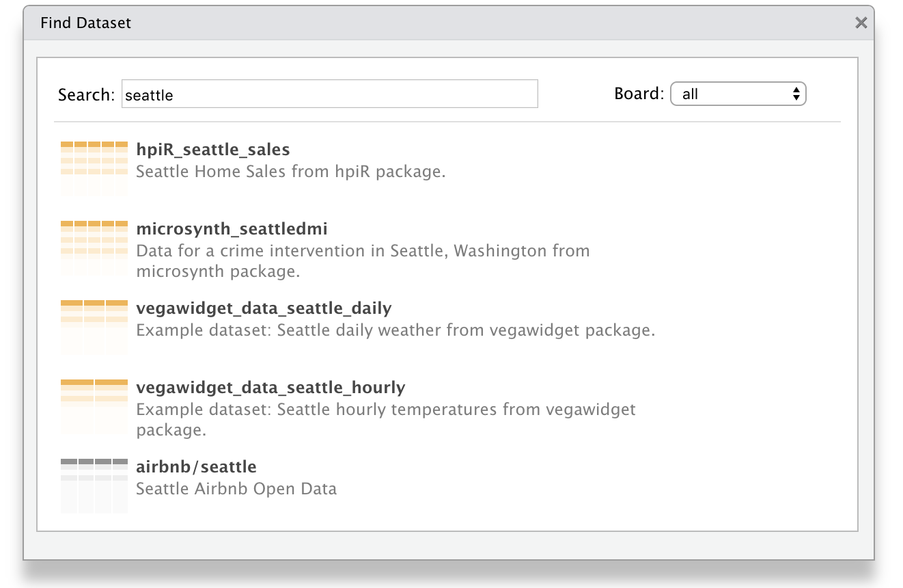

```{r setup, echo=FALSE, message=FALSE}
pins::unpin("sales")
```

You can use the `pins` package from **R**, or **Python**, to:

- **Track** local and remote datasets using `pin()` and `get_pin()`.
- **Discover** new datasets across different boards using `find_pin()`.
- **Share** datasets with your team, or the world with `use_board()`.
- **Datasets** can be used with RStudio, Kaggle, GitHub and databases boards.

To start using `pins`, install this package from CRAN:

``` r
install.packages("pins")
```

You can then **track** a dataset with `pin()`! You can pin remote files to cache those files locally, such that, even if the remote dataset is removed, your code will produce a warning but won't be broken.

```{r}
library(pins)
readr::read_csv(pin("https://raw.githubusercontent.com/facebook/prophet/master/examples/example_retail_sales.csv", "sales"))
```

Once you pin a dataset, you can analyze it and pin the resulting dataset again:

```{r}
get_pin("sales") %>%
  readr::read_csv() %>%
  dplyr::group_by(month = lubridate::month(ds, T)) %>%
  dplyr::summarise(total = sum(y)) %>%
  pin("sales_by_month")
```

You can also **discover** datasets using `find_pin()`; for instance, by searching datasets that mention "seattle":

```{r}
find_pin("seattle", board = "packages")
```

`find_pin()` searches datasets in CRAN packages by default; however, you can search other services, like Kaggle, with `register_board()`:

```{r}
register_board("kaggle", token = "<path-to-kaggle.json>")
find_pin("seattle")
```

Finally, you can also **share** your datasets by publishing to particular boards; Kaggle in the following example:

``` r
pin(iris, "iris", board = "kaggle")
```

And use all `pins` functionality from Python as well:

```{python}
import pins
import pandas as pd

pins.get_pin("hpiR_seattle_sales")
```

There are other boards you can use like GitHub or databases, see [Understanding Boards](https://rstudio.github.io/pins/articles/boards.html), and also RStudio products which we will present next. To use `pins` from Python, please refer to the [Using Python](https://rstudio.github.io/pins/#python) guide.

## RStudio

You can use [RStudio](https://www.rstudio.com/products/rstudio/) to discover and track datasets and [RStudio Connect](https://www.rstudio.com/products/connect/) to share datasets within your organization with ease.

To **discover** datasets, simply expand the "Addins" menu and select "Find Dataset" from the dropdown:



Notice that, the RStudio connections pane helps you **track** your datasets by providing each board as a connection you can explore:


You can **share** datasets using the RStudio Connect board. Lets use `dplyr` and the `hpiR_seattle_sales` pin to analyze this further and then share our results as a dataset in RStudio Connect:

```{r}
get_pin("hpiR_seattle_sales") %>%
  dplyr::group_by(baths = ceiling(baths)) %>%
  dplyr::summarise(sale = floor(mean(sale_price))) %>%
  pin("sales-by-baths", board = "rstudio")
```


You can now set the appropriate permissions in RStudio Connect, and voila! From now on, those with access can make use of this dataset from Python and R!

For instance, a colleague can reuse the `sales-by-baths` dataset by retrieving it from RStudio Connect and visualize it using `ggplot2`:

```{r}
library(ggplot2)

pins::get_pin("sales-by-baths") %>%
  ggplot(aes(x = baths, y = sale)) +
    theme_light() + geom_point() +
    geom_smooth(method = 'lm', formula = y ~ exp(x))
```

Please make sure to ~~pin~~ visit, [pins.rstudio.com](https://rstudio.github.io/pins/index.html), where you will find detailed documentation and additional resources. Thanks!
