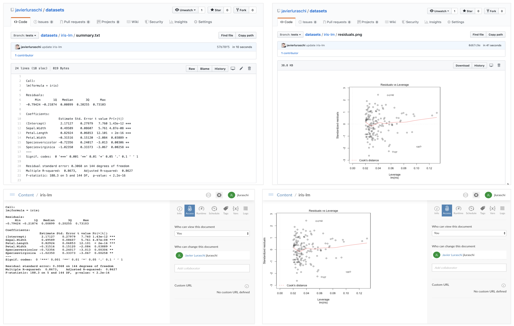

When you use `pin()`, the object being pinned (say, the data frame, list, matrix, etc) is serialized as an [RDS file](https://www.rdocumentation.org/packages/base/versions/3.6.1/topics/readRDS), a format native to R. This allows you to easily reload pins with `pin_get()` and have certainty that the object is exactly the same; however, this might not be ideal when sharing with others that might not use R as their primary environment or even if they are, it is convenient to preview what the pin contains when to easily discover resources.

Therefore, `pins` allows you to customize how a pin is stored by implementing a `pin()` S3 method for your particular object. As the [Understanding Boards](boards-understanding.html) boards article mentions, a board is a storage location and is the job of `pin()` to persist the object. For your particular `pin()` implementation, you should call `board_pin_store()` as the last step to push the files associated to your pin into the board the user is requesting to use.

Similarly, you will need to implement `pin_load()` for that particular object 'type' to reload the object. When implementing `pin_load()`, it is encouraged to also fallback when the serialized R object is not present, this allows others to create pins in other environments and programming languages.

To make this clear, consider the following example where we use a pin to share a fitted models with colleagues:

```{r eval=FALSE}
library(pins)

model <- lm(iris)
pin(model, name = "iris-lm")
```
```
Call:
lm(formula = iris)

Coefficients:
      (Intercept)        Sepal.Width       Petal.Length        Petal.Width  Speciesversicolor   Speciesvirginica  
           2.1713             0.4959             0.8292            -0.3152            -0.7236            -1.0235 
```

Although this works without the need to define a custom pin, we can do a bit better by considering what others might be interested in accessing from outside R or while discovering resources. The following example extends objects of type `lm`, to save additional metadata.

## Example

The following example creates a custom pin for a linear model produced with `lm`, it enhances the default pin by adding a summary in plain text, a residuals plot and the original formula as metadata which other systems can read without using R.

```{r eval=FALSE}
pin.lm <- function(x, name = NULL, description = NULL, board = NULL, ...) {
  path <- tempfile()
  dir.create(path)
  on.exit(unlink(path))

  # save model
  saveRDS(x, file.path(path, "model.rds"), version = 2)
  
  # save summary
  writeLines(capture.output(summary(lm(iris))), file.path(path, "summary.txt"))
  
  # save residuals vs fitted plot
  grDevices::png(file.path(path, "residuals.png"))
  plot(x)
  dev.off()
  
  metadata <- list(
    columns = list(formula = deparse(formula(x)))
  )

  board_pin_store(board, path, name, description, "linear_model", metadata, ...)
}

pin_load.linear_model <- function(path, ...) {
  readRDS(file.path(path, "model.rds"))
}

pin_preview.linear_model <- function(x, ...) {
  x
}
```

**Note:** The `metadata$columns` parameter is used to extract columns in RStudio's Connection viewer, if one is not specified, RStudio will display `unknown`.

Once defined, you can pin this model in any board you've previously registered,

```{r eval=FALSE}
model <- lm(iris)

# pin to local board
pin(model, name = "iris-lm")

# pin to github
pin(model, name = "iris-lm", board = "github")

# pin to rstudio connect
pin(model, name = "iris-lm", board = "rsconnect")
```
```
Call:
lm(formula = iris)

Coefficients:
      (Intercept)        Sepal.Width       Petal.Length        Petal.Width  Speciesversicolor   Speciesvirginica  
           2.1713             0.4959             0.8292            -0.3152            -0.7236            -1.0235 
```

Since additional metadata is being stored, other users can preview or access subsets of this models without having to reload it themselves. For instance, you can access those additional resources from [GitHub](boards-github.html) or [RStudio Connect](boards-rsconnect.html):

{width=100%}


