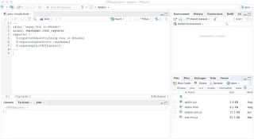
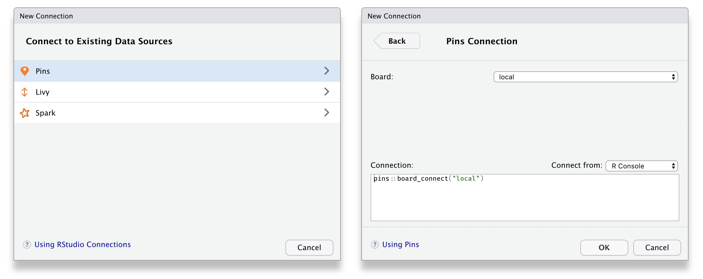
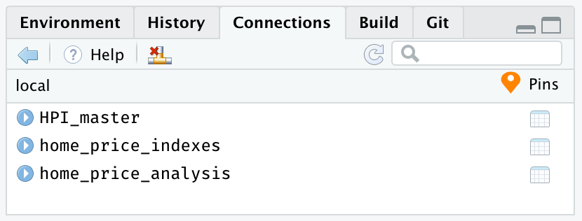

After installing the `pins` package, two features become available in RStudio: the **Find Pins Addin** and a new **Pins Connection** type. The addin allows you do discover datasets while the connection allows you to register new boards and manage your existing pins.

## Addin

You can use the Find Pins [Addin](https://rstudio.github.io/rstudioaddins) to visually discover resources, this functionality is equivalent to using `pin_find()`.

{width=440px}

To launch this addin, use the **Addins** toolbar and then select **Find Pins**:

{width=220px}

You can then use the search textbox to search across all registered boards, or select particular board from the dropdown to scope your search to particular ones. For instance, we can select the CRAN packages board and then search for 'home prices' which will update the results as you type. This example is equivalent to searching with `pin_find("home prices", board = "packages")`.

{width=380px}

Please notice that search is implemented differently in each board. For the CRAN packages board, the entire search string is searched, case insensitive, in the name and description. Other boards might implement more advanced or simple search algorithms.

## Connection

You can connect to several different boards to discover, pin and share resources. Those boards will be introduced in the [GitHub](boards-github.html), [Kaggle](boards-kaggle.html), and [RStudio Connect](boards-rsconnect.html) articles. However, you can also use this functionality to connect to the default local board, and explore the pins that you've created with `pin()`.

{width=440px}

First, open the RStudio's **Connections Pane**, followed by selecting **New Connection** from the toolbar, this action will launch the connection wizard with a new **Pins** connection type. The connection provides support to connect to multiple boards, but for now, we will use a **local** connection which stores pins in a local folder.

{width=600px}

Once connected to a board, you can browse pins available in that particular board using the connections pane. Each pin can then be expanded to show, when available, the columns each resource contains.

{width=600px}

You can then preview each resource by selecting the preview button which triggers code similar to `pin_preview(pin_get("<name>", board = "<connection-board>"))`.

{width=480px}

The next section, [Understanding Boards](boards-understanding.html), will properly present what exactly a board is and how to configure additional storage locations. However, it's worth mentioning here that the board registration process to Github, Kaggle and RStudio Connect boards can also be completed when creating a Pins Connection, just select the appropriate board from the drop down to configure each board.

{width=680px}

