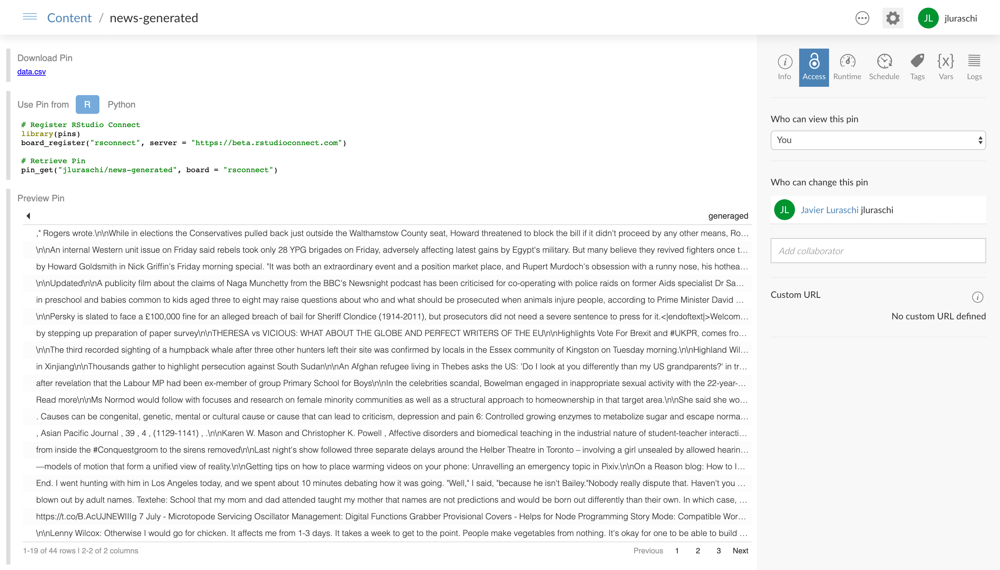

Once you have shared datasets (manually created by [Reusing Tidy Datasets](reuse-tidy-datasets.htm) or by [Automating Dataset Updates](automate-dataset-updates.html)), you can also consider creating code that depends on one or many pins to further process datasets or pin other objects like visualizations, models, and so on.

For instance, we could use the `worldnews` pin to create a deep learning model on a daily schedule. One of the state-of-the-art language models is [GPT-2](https://openai.com/blog/better-language-models/), which we can also use from R through the [gpt2](https://github.com/r-tensorflow/gpt2/) package.

Let's first install the package and dependencies,

```{r eval=FALSE}
remotes::install_github("r-tensorflow/gpt2")
gpt2::install_gpt2()
```

You can then retrieve the `worldnews` pin, apply the GPT-2 text generation model, and pin the result in a new pin -- which essentially creates a simple data processing pipeline:

```{r eval=FALSE}
library(pins)

pin_get("worldnews", board = "rsconnect") %>%
  dplyr::mutate(generated = gpt2::gpt2(title)) %>%
  pin("news-generated", board = "rsconnect")
```

You can preview this pipeline at [beta.rstudioconnect.com/connect/#/apps/6565/access](https://beta.rstudioconnect.com/connect/#/apps/6565/access)

[](https://beta.rstudioconnect.com/connect/#/apps/6565/access)

You can also automate this process by reusing the techniquest presented in the [Automate Dataset Updates](automate-dataset-updates.html) use-case.
