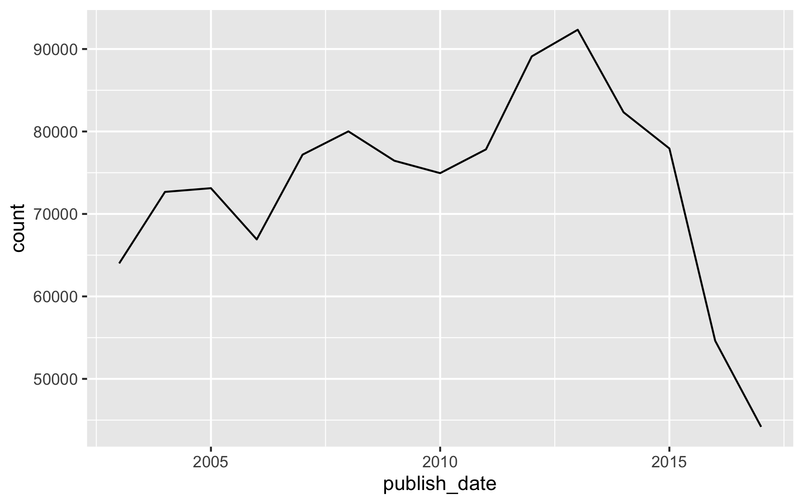

This notebook showcases the `pins` package ability to help you share and reuse tidy datasets with others. We will make use of the "A Million News Headlines" dataset from [kaggle.com/therohk/million-headlines](https://www.kaggle.com/therohk/million-headlines).

As a start, lets retrieve the dataset using `pins` and load it using `readr`. You will need to authenticate to Kaggle by downloading your token file from [kaggle.com/me/account](https://www.kaggle.com/me/account).

```{r eval=FALSE}
library(pins)
board_register_kaggle(token = "path/to/kaggle.json")

news <- pin_get("therohk/million-headlines", board = "kaggle") %>%
  readr::read_csv()

news
```
```
# A tibble: 1,103,663 x 2
   publish_date headline_text                                     
          <dbl> <chr>                                             
 1     20030219 aba decides against community broadcasting licence
 2     20030219 act fire witnesses must be aware of defamation    
 3     20030219 a g calls for infrastructure protection summit    
 4     20030219 air nz staff in aust strike for pay rise          
 5     20030219 air nz strike to affect australian travellers     
 6     20030219 ambitious olsson wins triple jump                 
 7     20030219 antic delighted with record breaking barca        
 8     20030219 aussie qualifier stosur wastes four memphis match 
 9     20030219 aust addresses un security council over iraq      
10     20030219 australia is locked into war timetable opp        
# … with 1,103,653 more rows
```

First, let's clean up this dataset. For instance, the 'publish_date' column is a character, not a date:

```{r eval=FALSE}
library(dplyr)

news_cleaned <- news %>%
  mutate(publish_date = as.Date(as.character(publish_date), format = "%Y%m%d"))

news_cleaned
```
```
# A tibble: 1,103,663 x 2
   publish_date headline_text                                     
   <date>       <chr>                                             
 1 2003-02-19   aba decides against community broadcasting licence
 2 2003-02-19   act fire witnesses must be aware of defamation    
 3 2003-02-19   a g calls for infrastructure protection summit    
 4 2003-02-19   air nz staff in aust strike for pay rise          
 5 2003-02-19   air nz strike to affect australian travellers     
 6 2003-02-19   ambitious olsson wins triple jump                 
 7 2003-02-19   antic delighted with record breaking barca        
 8 2003-02-19   aussie qualifier stosur wastes four memphis match 
 9 2003-02-19   aust addresses un security council over iraq      
10 2003-02-19   australia is locked into war timetable opp        
# … with 1,103,653 more rows
```

Let's also assume we are interested in understanding when news outlets publish news, not what headlines are published. For this, we can keep the counts per day and month and throw away the other columns:

```{r eval=FALSE}
news_totals <- news_cleaned %>%
  group_by(publish_date) %>%
  summarize(count = n())
```

We can now plot by month the total amount of news being produced by this news outlet:

```{r eval=FALSE}
library(ggplot2)

news_totals %>%
  group_by(publish_date = lubridate::floor_date(publish_date, "year")) %>%
  summarize(count = sum(count)) %>%
  ggplot(aes(x=publish_date, y=count)) +
  geom_line() 
```
{width=70%}

Now, while this might complete our particular analysis, others in your team might be interested in easily fetching your tidy dataset, which you can now easily share with `pins` in any available board. The following example uses RStudio Connect but this board can also be replaced to use Kaggle, GitHub or even custom boards:

```{r eval=FALSE}
pins::pin(news_totals, board = "rsconnect")
```

[](https://beta.rstudioconnect.com/connect/#/apps/6522/access)

You can then use the board's user interface to share this pin with others. A colleague can now reuse your tidy dataset by fetching it from the given board using pins:

```{r eval=FALSE}
pin_get("news-totals", board = "rsconnect")
```
```
# A tibble: 5,422 x 2
   publish_date count
   <date>       <int>
 1 2003-02-19     198
 2 2003-02-20     250
 3 2003-02-21     250
 4 2003-02-22     126
 5 2003-02-23     136
 6 2003-02-24     250
 7 2003-02-25     250
 8 2003-02-26     250
 9 2003-02-27     222
10 2003-02-28     249
# … with 5,412 more rows
```

You can preview the RStudio Connect pin for this tidy dataset at [beta.rstudioconnect.com/connect/#/apps/6522/access](https://beta.rstudioconnect.com/connect/#/apps/6522/access).
