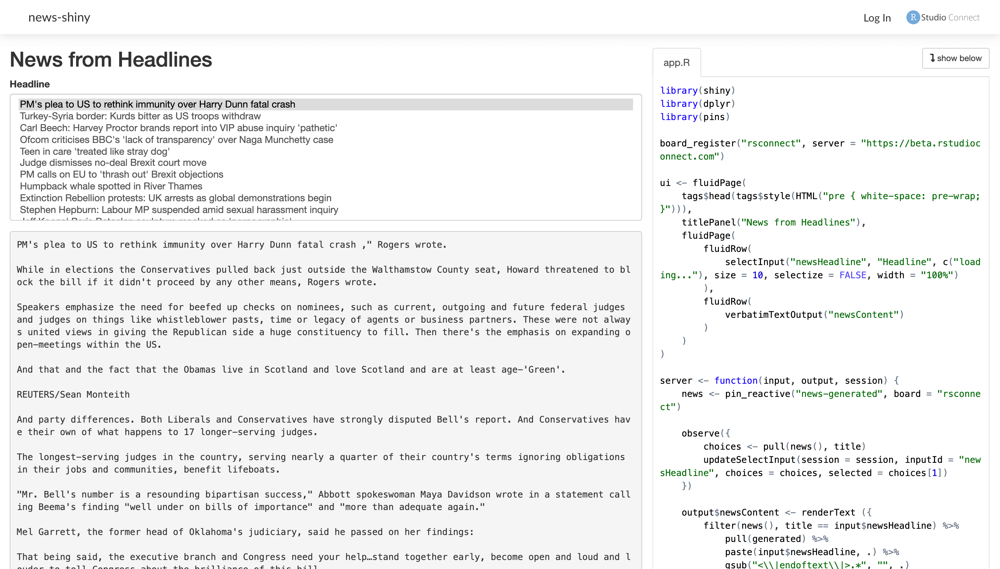

Once you [create data pipelines](create-data-pipelines.html), you can consider reusing the resources they produce in [Shiny](http://shiny.rstudio.com) or [Plumber](https://www.rplumber.io/) applications. This can be useful to componentize your application and avoid redeploying or restarting your application. 

When using Plumber, you can simply use `pin_get()` since this function is smart-enough to first check for updates before the resource is retrieved When using Shiny, you can use `pin_reactive()` which automatically transforms the pin's resource into a reactive to use from your application.

We can improve the pipeline from the [Create Data Pipelines](create-data-pipelines.html) use-case by properly generating a web application to display the auto-generated news.

A Shiny application that reuses the `news-generated` pin looks as follows:

```{r eval=FALSE}
library(shiny)
library(dplyr)
library(pins)

board_register("rsconnect", server = "https://beta.rstudioconnect.com")

ui <- fluidPage(
    tags$head(tags$style(HTML("pre { white-space: pre-wrap; }"))),
    titlePanel("News from Headlines"),
    fluidPage(
        fluidRow(
            selectInput("newsHeadline", "Headline", c("loading..."), size = 10, selectize = FALSE, width = "100%")
        ),
        fluidRow(verbatimTextOutput("newsContent"))
    )
)

server <- function(input, output, session) {
    news <- pin_reactive("news-generated", board = "rsconnect")

    observe({
        choices <- pull(news(), title)
        updateSelectInput(session = session, inputId = "newsHeadline", choices = choices, selected = choices[1])
    })

    output$newsContent <- renderText ({
        filter(news(), title == input$newsHeadline) %>%
            pull(generated) %>%
            paste(input$newsHeadline, .) %>%
            gsub("<\\|endoftext\\|>.*", "", .)
    })
}

shinyApp(ui = ui, server = server)
```

You can then run this application locally, and even publish it to [Shiny Server](https://rstudio.com/products/shiny/shiny-server/) or [RStudio Connect](https://rstudio.com/products/connect/). Notice that the news will update as soon as the `new-generated` pin is updated by the data pipeline previously defined. You can take a look at this application by visiting [beta.rstudioconnect.com/connect/#/apps/6578/access](https://beta.rstudioconnect.com/connect/#/apps/6578/access):

[](https://beta.rstudioconnect.com/connect/#/apps/6578/access)
